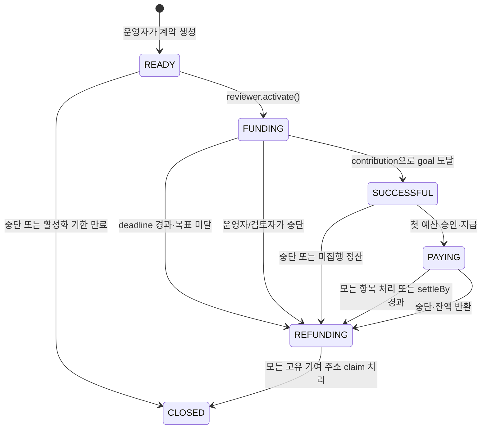

# FanPot — Codex 개발 전달용 명세

기준일: 2026-09-21. 이 파일은 전체 기획서에서 구현에 필요한 제품 범위·브랜드·화면·자금 규칙·보안·운영 제한·데모·개발 지시서를 모은 것이다. 혼동을 피하기 위해 원문의 절 번호를 유지했다. **마지막 15절이 실행 지시서**이며, 그 앞의 절들은 구현 시 따라야 할 고정 요구사항이다. 실제 배포를 완료한 기록이 아닌 구현 명세다.

이 문서를 기준으로 FanPot을 구현하라. 아이디어를 재평가하거나 다른 제품을 제안하지 말고, 명시한 범위와 자금 안전 규칙을 지켜라. 계정·키 등 실제 운영값이 없으면 코드를 먼저 완성하고 미실행 배포를 완료했다고 보고하지 마라.

---

## 1. 최종적으로 무엇을 만드는가

**FanPot은 팬들이 함께 만드는 K-pop 프로젝트의 참여 페이지이자, 사전에 공개한 규칙에 따라 USDC를 보관·지급·환불하는 프로젝트 금고다.**

제품 한 줄: **“좋아하는 마음을 모아, 약속한 프로젝트를 함께.”**

영문 정의: **FanPot is a programmable treasury for global fandom projects.**

팬의 흐름은 `Discover → Support → Celebrate → Follow the project`. 자금의 흐름은 `Fund → Hold by rules → Settle → Refund → Prove`다.

첫 출시에서 만드는 것은 다음 하나다.

> 운영자가 생일 광고·생일 카페 프로젝트를 만들고, 팬이 Arc의 USDC로 참여한다. 캠페인마다 별도 계약에 돈이 모인다. 목표에 도달하지 못하면 전액 환불 청구가 열린다. 성공하면 운영자가 미리 정한 예산 항목의 지급을 요청하고 별도 검토자가 승인하여 고정 지급처로 보낸다. 쓰지 않은 금액은 참여 비율대로 돌려받는다.

### 확정 결정표

| 항목 | 결정 |
|---|---|
| 초기 사용 사례 | K-pop 생일 광고와 생일 카페. 범용 크라우드펀딩 포털은 만들지 않는다 |
| 출시 형태 | 공개 열람 가능한 서비스 + 초대한 운영자의 소액 Mainnet 캠페인 |
| 제출용 규모 제한 | 계약에서 목표 최대 100 USDC, 지갑당 캠페인 누적 최대 20 USDC. 이는 안전 운영 한도이며 법적 면제 기준이 아니다 |
| 통화·네트워크 | Arc Mainnet의 native USDC. 앱 자금 처리는 공식 ERC-20 인터페이스의 6자리 단위 |
| 금고 | Factory가 배포하는 **캠페인별 독립·비업그레이드 계약**. clone/proxy 없음 |
| 모금 | All-or-nothing. 목표가 모금 상한이기도 함. 목표 도달 시 조기 성공·추가 입금 종료 |
| 예산 | 캠페인당 1~3개 항목. 각 항목의 지급처·상한·용도는 시작 전 고정 |
| 성공 지급 | 운영자 요청 + 별도 검토자의 승인·지급. 항목마다 최대 한 번 |
| 남은 돈 | **Refund proportionally만 지원**. Donate/Roll over 선택지는 MVP에서 제거 |
| 실패 환불 | supporter별 개별 claim. 원래 기여한 주소로만 반환 |
| 로그인 | 탐색·상세 열람은 로그인 없음. 참여 입력을 마친 후 기존 지갑 연결 |
| 개인정보 | 닉네임·X handle·공개 설정은 DB에만 저장. X 소유 인증 없음 |
| 언어 | 인터페이스 영어 기본 + 한국어. 브라우저 언어 최초 감지, 수동 전환 저장 |
| 수수료 | 제출용 계약 0%. 상용화 시 성공 집행금의 2% 단일 모델을 별도 버전에 도입 |
| 화면 | 탐색 홈, 상세, 참여·성공, 생성, 운영·검토, 내 참여. 내역·환불은 기존 화면에 통합 |
| 신뢰 표현 | “공개된 자금 규칙”과 “확인 가능한 지급 기록”. 광고 이행·원금·가치 보장을 약속하지 않는다 |

사용자 요청의 3,000 USDC 사례는 상용 제품 설명과 UI 디자인 예시로 사용한다. 제출용 100 USDC 한도를 몰래 풀어 실서비스처럼 운영하지 않는다. 한도 확대는 별도 검토·새 버전 배포 후 진행한다.

## 4. 독립 브랜드와 모바일 디자인 시스템

### 4.1 브랜드

정돈된 K-pop 팬 프로젝트 서비스. warm, polished, playful, trustworthy. 보라·분홍·파랑은 포인트로 사용하고 대부분의 화면은 흰색과 따뜻한 회색으로 구성한다. 하트·별·공동의 pot은 하나의 작은 심벌에만 조합한다. 기존 로고 파일은 제공되지 않았으므로 아래는 **로고 느낌을 바탕으로 한 제안 체계**이며 기존 로고를 보았다는 전제로 작업하지 않는다.

Weverse·Bubble에서는 팬 중심의 순서, 콘텐츠 우선, 편안한 모바일 읽기 경험만 참고한다. 화면 구조·정확한 색·글꼴 조합·아이콘·아티스트 이미지를 가져오지 않는다. 실제 아티스트 hero는 운영자가 사용권을 확보한 파일만 허용하고, 데모는 가상 아티스트와 독자적인 타이포 포스터를 사용한다.

### 4.2 디자인 토큰

| 항목 | 확정 값·용도 |
|---|---|
| Primary | `#6543C6` — 주 CTA, 진행률, 선택 상태. 흰색 텍스트 |
| Primary pressed | `#4F32A3` |
| Pink | `#E98FB1` — 장식·작은 celebration. 흰색 본문 배경으로 사용하지 않음 |
| Blue | `#7DA7DD` — 보조 일러스트·태그 배경 |
| Background / surface | `#FAF8FC` / `#FFFFFF` |
| Text / muted | `#241E32` / `#686173` |
| Border | `#E9E3EF` |
| Success / error | `#20724E` / `#B73848`; 상태명·아이콘을 함께 표시 |
| Soft purple | `#F0EAFC` |
| Typography | self-hosted **Noto Sans KR Variable** 한 종. Latin 포함. 시스템 sans-serif fallback. 라이선스 파일 포함 |
| Type scale | 12/16 보조, 14/20 label, 16/24 본문·입력, 20/28 section, 28/36 모바일 제목, 32/40 모금 숫자 |
| Weight | 본문 400, label 500, 제목 650, CTA·모금 700. 전체 굵은 글씨 금지 |
| Spacing | 4·8·12·16·24·32·48px. 모바일 좌우 20px, 360px 화면은 16px |
| Width | 모바일 단일 열, desktop 최대 1120px. 상세는 콘텐츠 680px + 참여 패널 340px |
| Radius | 입력·버튼 12px, 일반 카드 20px, 작은 chip 999px |
| Card | 1px border, 기본 그림자 없음. 주요 모금 카드만 `0 4px 20px rgba(36,30,50,.06)` |
| Button | 주요 52px 높이, 보조 44px. 하단 CTA safe-area 포함. disabled 이유를 가까이 표시 |
| Icon | Lucide의 heart·sparkles·clock·check·arrow-up-right·receipt. 20/24px, 1.75 stroke. 로고는 자체 SVG |
| Motion | hover/press 120ms, sheet 180ms, progress 250ms. 성공 heart 600ms 한 번. reduced-motion은 fade 또는 생략 |

색상 계산으로 확인한 명암비는 primary/white 6.62:1, text/background 15.23:1, muted/white 5.92:1, success/white 5.87:1, error/white 5.72:1이다. 실제 구현에서도 일반 텍스트 4.5:1, 큰 텍스트·UI 구성요소 3:1을 검사한다. 색만으로 성공·실패를 구분하지 않는다. 폰트 크기 16px 미만 입력창, 영구 깜박임, 자동 재생 영상, 무한 confetti는 금지한다. 글꼴 원본·라이선스는 [Noto CJK 공식 저장소](https://github.com/notofonts/noto-cjk)를 사용한다.

### 4.3 말투와 금액 표기

| 내부 개념 | 사용자 문구 |
|---|---|
| contribution | “프로젝트 응원하기” / “Support this project” |
| treasury | “모인 금액과 사용 내역” / “Funds & spending” |
| finalize | “모금 결과 확인” / “Check funding result” |
| refund available | “돌려받을 금액이 있어요” / “Your refund is ready” |
| payout requested | “사용 요청을 확인 중이에요” |
| payout executed | “예산에 따라 지급했어요” |
| successful | “모금 목표 달성” — “광고 집행 완료”로 표시하지 않음 |
| hidden amount | “금액 비공개” / “Amount hidden” |

금액은 항상 USDC라고 밝힌다. 확인 화면에서 “USDC는 달러 가치에 연동되도록 설계된 디지털 자산이며 환율·가격 변동 및 이용 비용이 생길 수 있어요” 설명을 펼쳐볼 수 있게 한다. `$10`만 표시하여 카드 USD 결제처럼 오인시키지 않는다. 제출용 작은 금액은 소수 최대 6자리, 주요 합계는 2자리 표시 + 정확한 값 열람을 제공한다.

### 4.4 가장 중요한 캠페인 상세 구성

```text
[FanPot]                              [EN/KO] [내 참여]

[사용권 확보 hero / 가상 아티스트 포스터]
LUMI · Birthday project
서울에서 함께 빛나는 생일
Seoul Subway Birthday Ad
by @lumi_support  ·  팬이 운영하는 프로젝트

2,430 / 3,000 USDC
[████████████████░░░░] 81%
570 USDC 더 모으면 목표 달성 · 5일 남음
143명이 함께하고 있어요*   [참여자 보기]
[💜 이 프로젝트 응원하기]

약속한 자금 규칙
목표 미달: 참여금 환불 청구 가능
목표 달성: 예산별 승인 후 지급
남은 금액: 참여 비율대로 환불

우리가 만들 장면           — 프로젝트 설명
어디에 사용하나요?        — 지하철 2,200 / 카페 600 / 잔액 환불
함께한 팬들               — 작은 avatar·이름·선택 공개 금액
프로젝트 소식             — 운영 공지·지급 상태
모인 금액과 사용 내역      — 펼치기, Arc 거래 확인

[하단 고정: 목표까지 570 USDC | 응원하기]
```

이는 상용 UI의 설명용 숫자이며 seed 실적이 아니다. `143명`은 제품에서는 **고유 참여 지갑 143개**를 뜻한다는 tooltip을 둔다. 실제 사람의 본인 인증 인원처럼 주장하지 않는다. 참여자 전체 목록과 별도로 고액 순위는 없다.

첫 화면에서는 아티스트·프로젝트·모인 금액·부족액·기간·함께한 팬이 우선이다. 총 모금액은 지급 후에도 줄어들지 않는다. 현재 보관 잔액은 별도 “사용 내역”에서 보여준다. 상단 진행률에 treasury balance를 넣으면 지급할 때 프로젝트 모금 성과가 감소하는 오류가 생긴다.

## 5. Treasury architecture와 신뢰 경계

### 5.1 세 가지 구조 비교

아래는 이번 요구사항을 기준으로 한 설계 판단이다. 모든 구조가 안전하다는 감사 결과가 아니다.

| 기준 | 캠페인별 smart contract | 단일 contract + campaign ID | smart account / programmable wallet |
|---|---|---|---|
| 보안 | 캠페인 자산·상태 격리. 동일 코드 결함은 여러 캠페인에 반복될 수 있음 | 회계 분리 오류·공용 권한 오류가 전체 잔액에 영향 | owner가 일반 transfer를 할 수 있다면 refund·예산 규칙 우회 가능 |
| 개발 난이도 | 작은 계약과 Factory. 배포·주소 관리 필요 | 배포 간단, 모든 함수에 ID·캠페인별 장부 정확성 필요 | 정책 강제 모듈·복구·서명·provider 상태까지 설계하면 커짐 |
| refund | 독립된 contribution mapping과 고정 refund pool | 캠페인별 liability 분리 필수 | 환불 권리를 강제할 별도 escrow 모듈 필요 |
| payout | 고정 수취인·상한·검토자 조건을 계약에서 강제 | 구현 가능하나 전역 권한 최소화가 중요 | 단순 API 정책은 owner 서명 우회를 막지 못함 |
| gas | 생성 비용 상대적으로 높음 | 생성 비용 낮음 | 계정 배포·user operation 비용과 운영비 발생 |
| auditability | 한 주소의 입출금과 해당 캠페인 규칙을 대조하기 쉬움 | 주소 하나에 모든 캠페인이 섞여 ID별 분석 필요 | 서명 정책·모듈·업그레이드 경로까지 검토 |
| scalability | 초기 수십~수백 캠페인에 충분. 이후 clone 고려 가능 | 대규모 생성에 효율적 | UX 확장에는 유용, treasury 강제 규칙은 별도 필요 |
| 데모 적합성 | “이 프로젝트의 돈은 이 주소”가 명확함 | 구현은 가능, 설명에 ID 장부 개념 추가 | 지갑 데모에 초점이 옮겨가기 쉬움 |

**최종 선택: Factory + 캠페인별 완전한 비업그레이드 계약.** Factory는 배포·등록만 한다. 기존 캠페인 자금을 이동하거나 규칙을 수정하지 못한다. 스마트 지갑은 미래의 supporter 접근 수단이며 escrow의 대체물이 아니다.

### 5.2 역할과 고정값

| 역할 | 가능한 일 | 불가능한 일 |
|---|---|---|
| 운영자 organizer | 초안 작성, 계약 생성, 시작 전 정보 확인, 예산별 지급 요청, 불필요한 항목 포기, 프로젝트 중단·잔액 환불 전환, 공지 업로드 | 단독 지급, 주소 교체, 예산 증액, deadline 연장, 환불 차단 |
| 검토자 reviewer | 생성된 규칙 확인 후 활성화, 요청을 대조하고 승인·지급, 항목 거절/포기, 중단 후 잔액 환불 전환 | 새 지급처 설정, 임의 출금, 환불액 수정, supporter 자금 수취 |
| supporter | 기여, 본인 표시 설정 변경, 본인 또는 다른 지갑의 환불 청구 실행 | 지급 승인, 다른 주소의 환불금 수취 |
| platform publisher | Factory의 신규 운영자 허용·회수, 악성 콘텐츠 비노출, 서비스 운영 | 이미 생성된 계약의 자금 출금·업그레이드·환불 중단 |
| anyone | 시간 조건 충족 후 finalize/settle, 원래 supporter 주소로 claim 대행 | 임의 수취 주소 지정 |

제출 버전 reviewer는 Factory 생성 시 지정한 한 주소로 고정한다. 운영자는 reviewer와 다르고, 수취인도 organizer·reviewer·0주소·계약 자신과 달라야 한다. 주소가 다르다는 것만으로 사람이 독립적이라고 증명되지는 않는다. 실제 파일럿에서는 운영자와 이해관계가 다른 사람이 검토하고, UI에 역할과 확인 범위를 공개한다. 데모에서 개발자가 여러 지갑을 관리하면 **시연 역할 지갑**이라고 표시한다.

운영 정책의 모금 기간 최솟값은 활성화 시 24시간, 생성 시 최댓값은 30일이다. 기본은 7일 후 마감이다. 최소 기여 0.1 USDC이며 최종 부족액이 그보다 작으면 정확한 부족액만 예외로 받는다. 각 지갑 한도 20 USDC를 그대로 적용한다.

고정값: `organizer`, `reviewer`, `USDC`, `goal`, `deadline`, `settleBy = deadline + 14 days`, `rulesHash`, 예산 목록의 `recipient/cap/purposeHash`, 실패·잔액 정책. setter와 관리자 override를 만들지 않는다.

### 5.3 성공 자금 집행 — 한 번의 명확한 승인

1. 캠페인은 목표 도달 전까지 자금을 계약에 보관한다.
2. 목표 도달로 SUCCESSFUL 상태가 된다. UI에 “모금 목표 달성 · 사용 준비 중”을 표시한다.
3. 운영자가 항목별로 **고정 수취인, 실제 요청금액 ≤ 상한, 공개용으로 가린 증빙의 hash**를 지급 요청한다.
4. 검토자가 수취인 명칭·주소, 견적/영수증, 금액, 목적을 확인한다.
5. `approveAndPay(index, expectedAmount, expectedEvidenceHash)`가 요청값 일치를 검사한 뒤 그 항목 수취인에게 전송한다. 승인과 전송은 하나의 트랜잭션이다.
6. 항목은 PAID가 되어 재지급할 수 없다. 모든 항목이 PAID/SKIPPED면 누구나 정산을 연다.
7. 남은 금액은 refund pool이 된다. 미처리 항목이 있더라도 `settleBy`가 지나면 누구나 정산을 열며 그 이후 지급은 금지된다.

각 항목은 한 번만 요청할 수 있고, 요청 이후 금액·증빙을 교체하지 못한다. 오류가 있으면 해당 항목을 SKIPPED로 처리하고 돈을 환불한다. 수정 재요청·분할 기성금·분쟁 중재는 MVP 범위 밖이다. 1~3개 항목의 반복 처리는 상한이 고정되어 허용되지만, supporter 전체를 순회하는 자금 전송은 금지한다.

검토자는 영수증 hash만 보고 진위를 알 수 없다. hash는 제출 문서가 나중에 바뀌지 않았음을 대조하는 도구이고, 실제 광고 송출 여부는 업체 확인·현장 결과물에 달려 있다. **검토자와 운영자의 공모, 허위 업체, 지급 후 공급자 미이행은 계약만으로 막지 못한다.**

### 5.4 한국 광고업체·카페가 지갑이 없는 경우

| 단계 | 자금·업무 구조 |
|---|---|
| Microgrant 시연 | 실제 USDC가 고정 demo recipient로 이동. 가상 광고/카페 예산임을 표시하고 실제 업체 결제 완료라고 주장하지 않음 |
| 실제 소액 파일럿 | USDC를 적법하게 수령할 수 있는 공급자 또는 검토된 정산 파트너가 있는 프로젝트만 선정. 업체에 지갑도 정산 파트너도 없으면 해당 프로젝트의 실제 모금은 시작하지 않음. 운영자 개인 지갑으로 넘기는 예외를 열지 않음 |
| 상용 구조 | 허가·지원 범위를 검토한 결제/정산 파트너가 계약의 고정 recipient. 파트너가 원화로 업체에 지급하고 견적, 환율, 수수료, 지급 증빙을 연결. FanPot은 자체 환전·송금 서비스를 운영하지 않음 |

상용 파트너는 아직 확보되었다고 가정하지 않는다. 원화 정산 파트너 계약, 국가별 지원·본인확인, 환율 견적 유효기간, 세금·영수증·환불 책임을 확정하기 전에는 “한국 업체 원화 결제 지원”을 live 기능으로 광고하지 않는다. 예산을 초과하는 환율·원화 비용은 추가 무단 인출로 메우지 않고 운영자 부담 또는 해당 항목 취소로 처리한다.

## 6. 실제 구현할 계약 상태 머신

단일 enum에 결과와 행동을 뒤섞지 않는다. `Phase`는 현재 돈의 처리 단계, `Outcome`은 모금 결과다. DRAFT는 DB에만 존재한다.



`enum Phase { Ready, Funding, Successful, Paying, Refunding, Closed }`

`enum Outcome { Undecided, Successful, Failed, Cancelled }`

정산할 금액이 0이면 REFUNDING을 거치지 않고 CLOSED로 바로 이동한다. 성공 뒤 중단되어도 모금 Outcome은 Successful을 유지하고 `SettlementReason.Stopped`를 따로 기록한다. “성공했으니 집행까지 완료했다”는 잘못된 표시를 막기 위함이다.

| 상태 | 허용 action | USDC 위치 | 운영자 권한 | supporter 권한 |
|---|---|---|---|---|
| DRAFT (offchain) | 저장·수정·삭제·publish 준비 | 팬의 지갑 | 전체 초안 수정 | 열람 불가, 미리보기만 별도 |
| READY | reviewer.activate, 역할자의 stop, 만료 후 finalize | 정상 입금 0 | 재배포 또는 중단. 생성한 규칙 변경 불가 | 기여 불가 |
| FUNDING | contribute, deadline 후 finalize, stop | 캠페인 계약 | 공지만 추가, 중단 가능 | 기여. 임의 중도 출금은 없음 |
| SUCCESSFUL | requestPayout, approveAndPay, skipAllocation, settle, stop | 아직 캠페인 계약 | 고정 항목 지급 요청 | 상태 확인. 정산 전 잔액 환불 claim 불가 |
| PAYING | 남은 항목 요청·승인, skip, settle, stop | 일부 수취인 + 계약 잔액 | 남은 항목만 요청 | 집행 기록 확인 |
| REFUNDING | claimRefund, claimRefundFor | 아직 claim 안 한 몫은 계약 | 추가 지급·기여·수정 불가 | 본인 환불 청구, 대행 claim 가능 |
| CLOSED | read only | 지급/환불 완료, 극소수 반올림 잔액·비정상 직접 송금이 남을 수 있음 | 읽기 | 읽기 |

### 시간·금액·전이 규칙

- `block.timestamp < deadline`일 때만 기여. 정확히 deadline이면 기여 거절, 실패 판정 가능.
- goal은 hard cap이다. `totalContributed + amount > goal`이면 전체 revert. 부분만 자동 수납하지 않는다. 화면에서 부족액으로 다시 확인하도록 한다.
- 목표 도달 기여와 SUCCESSFUL 전환은 같은 트랜잭션. 추가 finalize를 요구하지 않는다. 초과 모금은 없지만 예산 차액·미집행액의 surplus는 존재한다.
- deadline 이전 `finalize()`는 FUNDING에서 NotReady. 이후 부족액이면 Failed로 정산한다. 이후 반복 finalize는 no-op으로 현재 상태를 반환하고 이벤트를 중복 발생시키지 않는다.
- `requestPayout`와 `approveAndPay` 모두 SUCCESSFUL/PAYING이며 `now < settleBy`일 때만 가능. `now == settleBy`부터 누구나 settle 가능.
- payout 없는 SUCCESSFUL에서도 모든 항목을 포기하면 즉시 정산 가능. 모금 성공 이후 조기 정산은 돈을 반환하는 방향으로만 작동한다.
- `stop()`은 organizer/reviewer만 사용. Ready/Funding에서는 Cancelled, 성공 이후에는 Successful outcome을 유지하면서 **남아 있는 계약 장부 금액만** refund pool로 확정한다. 이미 지급한 돈을 되돌렸다고 표시하지 않는다.
- `settle()`은 SUCCESSFUL/PAYING에서 모든 항목 terminal 또는 settleBy 경과 시 허용. REFUNDING/CLOSED에서는 no-op. FUNDING 실패 판정은 finalize 사용.
- 미입금 캠페인의 실패·중단은 division-by-zero 없이 CLOSED. 활성화하지 않은 READY는 deadline 이후 누구나 finalize하여 Cancelled/CLOSED.
- 누군가 시계만 지나갔다고 계약 스토리지가 자동 변경되지는 않는다. UI는 시간상 “결과 확정 가능”을 파생 표시하고, 실제 action이 transaction을 실행한다.

### 6.1 환불 계산

**개별 claim 선택.** supporter 수와 무관한 O(1) 연산으로 자기 몫을 반환한다. 실패한 한 주소의 수령 문제가 다른 supporter의 환불을 막지 않는다.

기호: `T` = 누적 정상 기여액, `P` = 실제 지급 합계, `R = T - P` = 정산 시 한 번 고정한 refund pool, `C[a]` = 주소 a의 누적 기여.

`refund[a] = Math.mulDiv(C[a], R, T)` — 정수 내림. 실패·모금 중 취소는 P=0이므로 각 주소가 정확히 원금을 돌려받는다. gas는 별도이며 원금 환불에 포함되지 않는다. Refund gas도 USDC로 지불하므로 지갑 잔액의 순증가가 claim 금액보다 작을 수 있다.

예: T=3,000, P=2,800, R=200, C[a]=50이면 환불은 **3.333333 USDC**. 총액 50과 환불 가능액 3.333333을 별도 표시한다. 모든 계산은 원화나 부동소수점이 아닌 USDC base units를 사용한다.

`claimed[a]`를 transfer 전에 true로 설정한다. `claimedCount`와 `totalRefunded`도 먼저 갱신하고, SafeERC20 전송 실패 시 전체 transaction이 revert되므로 청구권이 소비되지 않는다. 본인 claim과 대행 claim 모두 recipient는 a로 고정한다.

기여 주소가 N개면 내림으로 남는 dust는 **N micro-USDC 미만**이다. MVP에서는 누구도 이 잔액을 수익으로 가져가지 않고 계약에 둔다. 모든 고유 주소가 claim 처리되면 CLOSED이며 `roundingRemainder`를 표시한다. 0원으로 계산된 주소도 기록상 claim 처리할 수 있게 하되 전송 호출은 생략한다. R=0이면 모든 사람에게 0원 claim을 요구하지 않고 즉시 CLOSED다.

미청구 환불금은 무기한 청구 가능하고 운영자가 가져갈 수 없다. gas보다 작은 잔액에 대해서는 “즉시 청구가 경제적이지 않을 수 있음”과 대행 claim 경로를 알려준다. 자동 일괄 환불·claim 만료·임의 dust sweep는 없다. 일부 사용자가 영원히 claim하지 않으면 REFUNDING에 남는 것은 정상이다.

### 6.2 장부 불변식과 비정상 직접 송금

`accountedBalance = T - P - totalRefunded`

정상 운영에서는 `USDC.balanceOf(campaign) >= accountedBalance`. 성공 전에는 P=0. 정산 후에는 R이 절대 변하지 않는다. 정상 운영 gas는 action을 보낸 지갑에서 지불되므로 treasury에서 차감하지 않는다.

USDC를 계약 주소로 직접 transfer하면 contribution mapping과 supporter list에 등록되지 않는다. native `receive/fallback`은 revert시키되 ERC-20 직접 transfer나 강제 잔액 변화를 완전히 차단할 수는 없으므로 **goal을 실제 잔액으로 판정하지 않는다**. `excess = max(actualBalance - accountedBalance, 0)`는 “등록되지 않은 입금”으로 분리한다. 이를 payout·refund pool에 넣거나 관리자가 회수하는 함수를 MVP에 만들지 않는다. UI는 계약 주소로 직접 보내지 말고 지원 버튼을 사용하도록 안내한다.

USDC issuer freeze·체인 장애·토큰 동작 변경으로 실제 송금이 불가능할 수 있다. 이때 성공으로 표시하지 않고 오류와 남은 청구권을 보존한다. 가용잔액이 장부보다 작으면 자동 성공 표시를 멈추고 운영 경보를 발생시킨다.

## 7. 화면별 구현 명세

공통: 360/390/430px 우선 검증. page skeleton은 실제 레이아웃 높이를 보존한다. 모든 쓰기 버튼은 중복 제출 방지, 거절 시 입력 유지, 완료 후 실제 receipt 기반 갱신. 서버 장애 시 0 USDC를 보여주지 않고 “업데이트를 확인할 수 없어요”로 표시한다.

### 7.1 탐색 홈 — `/`

| 항목 | 명세 |
|---|---|
| Purpose | 링크로 방문한 팬이 지금 함께할 프로젝트를 발견 |
| Layout | 작은 브랜드 헤더 → 한 문장 소개 → 캠페인 카드 → 자금 규칙 3줄 → footer |
| Components | CampaignCard, StatusChip, ProgressBar, LanguageSwitch, MySupportLink |
| CTA | “프로젝트 보기”, 보조 “프로젝트 만들기” |
| Data | 검토·활성화된 캠페인 hero/title/artist/goal/total/deadline/unique supporters. 최근 시작순, 진행 중 우선 |
| Loading | 카드 3개 skeleton. 이미지 aspect-ratio 고정 |
| Empty | “첫 프로젝트를 준비하고 있어요” + 운영자 안내 |
| Error | 재시도 버튼. 기존 데이터에는 마지막 업데이트 시간 |
| Success | 실제 목록. demo 카드는 눈에 보이는 DEMO label |

별도 Landing과 Discover는 합친다. 검색·추천 알고리즘·장르 필터는 만들지 않는다.

### 7.2 캠페인 상세 — `/c/[slug]`

| 항목 | 명세 |
|---|---|
| Purpose | 프로젝트의 감성·계획·규칙을 이해하고 참여 결정 |
| Layout | 4절 상세 구조. 사용 내역은 하단 접이식 영역. 상태 CTA는 하단 고정 |
| Components | Hero, OrganizerLine, FundingSummary, RulesCard, AllocationList, SupporterWall, UpdateList, FundsLedger, StickySupportBar |
| CTA | 모금 중 Support, 성공 후 Follow/View updates, 실패·정산 후 My refund |
| Data | 고정 rules snapshot + live onchain summary + 비식별 supporter 공개 projection + 공지 |
| Loading | hero·title skeleton, 모금칸 loading. 숫자를 임의로 0으로 초기화하지 않음 |
| Empty | “첫 번째 응원을 남겨주세요”, 공지 없으면 “준비 소식을 이곳에 전할게요” |
| Error | 못 찾으면 404; rulesHash 불일치면 결제 비활성·규칙 확인 안내; RPC 장애면 마지막 조회 표시 |
| Success | 참여 완료 후 자기 항목으로 이동. 숨김 설정에 맞춰 표시 |

숨긴 contribution의 activity에는 실시간 tx 링크·초 단위 시각·금액을 이름과 묶어 내보내지 않는다. 공개 회계 내역은 별도의 이름 없는 거래 목록으로 제공한다. 이 조치도 체인 추적·시각 상관관계를 완전히 막지는 않는다.

### 7.3 참여 — `/c/[slug]/support`

| 항목 | 명세 |
|---|---|
| Purpose | 금액·표시 설정·비용·규칙 확인 후 기여 |
| Layout | 프로젝트 요약 → 금액 preset → 한 줄 이름/익명 → 금액 공개 toggle → 요약·약관 → Continue → 필요할 때 wallet sheet |
| Components | AmountPicker, DisplayPreferenceForm, RulesConsent, WalletStep, CostSummary, TransactionStatus |
| CTA | “계속”, 연결 뒤 “USDC 사용 승인”, 다음 “10 USDC로 응원하기” |
| Data | remaining capacity, 주소 누적 한도, allowance, USDC/native 단일 잔액, 두 transaction 추정 gas |
| Loading | 시뮬레이션과 수수료 계산 동안 confirm 비활성. 입력은 유지 |
| Empty | 미연결은 정상. 잔액 0이면 준비 도움말, 결제되지 않았음을 명시 |
| Error | 잘못된 체인·거절·부족한 gas·마감·remaining 변경·한도 초과를 개별 문구로 처리 |
| Success | 실제 contribution receipt 성공 후 success route로 이동 |

기본 preset은 5/10/20/Custom USDC. goal 20 이하 소액 demo는 1/2/5/Custom. 금액 공개는 기본 OFF, 이름은 기본 Anonymous. 실명·국가·전화번호를 결제 입력으로 요구하지 않는다. 선택 입력을 한 화면에 모아 단계 수를 줄인다.

지갑 없는 팬을 버튼만으로 결제 완료할 수 있다고 오인시키지 않는다. amount 영역 아래 작은 안내: **“현재는 Arc의 USDC와 호환 지갑으로 참여할 수 있어요.”** 상단 방문 즉시 Connect Wallet을 강요하지 않는다.

### 7.4 참여 완료 — `/c/[slug]/thanks?tx=…`

| 항목 | 명세 |
|---|---|
| Purpose | 실제 완료를 확인하고 소속감 제공 |
| Layout | 작은 heart → “함께해줘서 고마워요” → 프로젝트명·참여금(본인 화면) → receipt 상태 → CTA |
| Components | ContributionReceipt, CelebrationHeart, ShareLink, FollowProject |
| CTA | “프로젝트 소식 보기”, 보조 “링크 공유” |
| Data | contract event를 검증한 tx·amount·supporter ordinal·updated funded total |
| Loading | receipt 검증 중에는 “확인 중”. celebration 없음 |
| Empty | tx 없으면 상세로 복귀 |
| Error | tx가 다른 체인/계약이거나 revert면 성공 화면 금지. 복구 링크 |
| Success | 첫 방문에서만 1회 애니메이션. 새로고침해도 추가 기여나 인원 증가 없음 |

공유 링크에는 이름·지갑·금액을 붙이지 않는다. 자동 이미지 share card는 제외한다. OG 이미지는 캠페인 hero와 공개 목표 정도만 포함한다.

### 7.5 생성 — `/create`와 `/create/[draftId]`

| 항목 | 명세 |
|---|---|
| Purpose | 규칙이 완성된 캠페인을 발행 |
| Layout | 기본 정보 → 예산·기간 → 규칙 확인·미리보기, 3개 section을 한 form으로 구성 |
| Components | CampaignForm, HeroUpload, AllocationEditor(1~3), DeadlineField, ImmutableRulesPreview |
| CTA | “초안 저장”, “규칙을 고정하고 생성” |
| Data | artist/project name, title, description, rights-confirmed hero, goal, deadline, allocations, reviewer, policy snapshot |
| Loading | 저장 indicator, 생성 tx 단계 표시 |
| Empty | 폼은 빈 값. 허구의 아티스트·목표를 실제 draft 기본값에 넣지 않음 |
| Error | 필드별 오류, 허용되지 않은 운영자 안내, 업로드 실패 시 기존 입력 보존 |
| Success | READY 계약 생성 확인 → “검토 후 모금을 시작할 수 있어요”와 관리 링크 |

refund/surplus는 드롭다운 없이 고정 정책 카드로 표시한다. 운영자가 선택할 수 없는데 선택하는 것처럼 보이는 UI는 만들지 않는다. 시작 전 reviewer의 활성화 승인이 필수다.

### 7.6 운영·검토 — `/manage/[campaignId]`

| 항목 | 명세 |
|---|---|
| Purpose | 다음 필요한 작업 하나를 정확히 안내하고 집행 |
| Layout | 프로젝트 상태 → next action → 예산 항목 → 증빙/공지 → 자금 내역 |
| Components | ActivationReview, PayoutRequestForm, ReviewerApprovalCard, SettlementPanel, StopProjectDialog, UpdateComposer |
| CTA | 역할·상태별 “모금 시작”, “지급 요청”, “검토 후 지급”, “미사용 처리”, “잔액 정산” |
| Data | connected actor, 고정 rules, allocation status·amount·recipient·evidenceHash, deadline/settleBy |
| Loading | 요청 전 simulation, tx 확정 대기, 파일 hash 확인 |
| Empty | 요청 없는 항목은 “아직 사용 요청이 없어요” |
| Error | 역할 불일치·이중 처리·기한 경과·증빙 불일치·송금 실패를 구체적으로 표시 |
| Success | 실제 지급 event 후 금액·고정 recipient·tx. 증빙은 확인 범위를 명시 |

검토자 승인 화면에는 전체 주소·수취인 명칭·실제 금액·예산 상한·증빙을 한 번에 보여준다. 디바이스에서 서명한다. 웹 서버에는 지급용 private key가 없다. “중단”에는 이미 지급된 금액과 반환 가능한 잔액을 숫자로 보여주는 확인 dialog가 필요하다.

### 7.7 내 참여·환불 — `/me`

| 항목 | 명세 |
|---|---|
| Purpose | 참여한 프로젝트·소식·돌려받을 금액 확인 |
| Layout | 환불 가능한 항목 우선 → 진행 중 → 완료. 각 카드에 금액과 상태 |
| Components | MyContributionCard, ClaimRefundButton, DisplayPreferenceEditor, WalletReconnect |
| CTA | “환불받기”, “프로젝트 보기”, “표시 설정 변경” |
| Data | 연결 주소의 C[a], claimable, claimed, outcome·phase, offchain preferences |
| Loading | session 확인과 onchain claimable 조회 분리 |
| Empty | “아직 함께한 프로젝트가 없어요” + 탐색. 다른 주소일 수 있다는 연결 주소 확인 |
| Error | DB 문제와 RPC 문제 분리. DB가 없어도 계약 주소로 청구 안내 가능 |
| Success | `RefundClaimed` receipt 후 “X USDC를 돌려받았어요”. 재청구 버튼 없음 |

비노출 캠페인도 이미 참여한 팬의 내 참여·환불 접근은 유지한다. 콘텐츠 비노출이 금전 기록이나 청구권 삭제로 이어지면 안 된다. 별도 User Profile·Refund·Transparency 페이지는 만들지 않는다. `/c/[slug]#funds`, `/c/[slug]#updates`, `/me`로 충족한다. 약관·개인정보·도움말은 정적 `/terms`, `/privacy`, `/help`로 제공한다.

## 8. 최소 기술 구성과 데이터 경계

**Next.js App Router + TypeScript + Tailwind CSS + wagmi + viem + TanStack Query + Solidity + OpenZeppelin + Foundry + Supabase(Postgres/Storage) + Vercel**로 확정한다. Zod로 입력을 검증한다. 인증은 EIP-4361(SIWE) 형식의 지갑 서명 세션이다.

별도 Express 서버, ORM, Redis, GraphQL, The Graph, Supabase Realtime, 자체 queue, IPFS pinning, Circle Wallets SDK는 MVP에 추가하지 않는다. SDK·compiler는 구현 시작 때 보안 공지를 확인한 안정 버전을 정확한 버전/commit과 lockfile로 고정한다. 설치 때마다 `latest`로 바뀌게 두지 않는다. Solidity는 `0.8.30`, optimizer 200, `evm_version = "cancun"`을 기본 빌드 타깃으로 고정하고 Arc에서 사용하는 opcode 지원과 실제 배포를 검증한다. 고급 AA·Arc 전용 transaction extension은 사용하지 않는다.

Arc는 공식적으로 Arc Foundry 배포 흐름도 제공한다. 기본 Foundry로 표준 EVM 계약의 unit/fuzz 테스트를 돌리고 Arc 테스트·배포 호환성 확인에는 공식 Arc Foundry를 핀된 도구로 사용한다. 둘의 compiler 설정·산출물이 일치해야 한다. [Arc Foundry 배포 가이드](https://docs.arc.io/integrate/deploy-on-arc)

| onchain — 금전 권리의 기준 | offchain — 표시·운영 데이터 |
|---|---|
| 역할 주소, USDC 주소, goal/deadline/settleBy | artist/project name, title, hero, description |
| 예산 수취인·상한·purposeHash | 예산 항목명·수취인 명칭, public rules JSON |
| rulesHash, phase, outcome, settlementReason | 닉네임·X handle·익명·금액 공개 설정 |
| 주소별 기여, 누적 기여, supporter count | 사용권 확인, 운영 공지, 공개용으로 가린 증빙 파일 |
| 지급 요청·금액·evidenceHash·지급 여부 | 증빙 설명과 서버 검증 상태 |
| 고정 refund pool, claim 여부·환불 합계 | 검색 목록, cached chain state, UI 이벤트 |

Social identity나 raw 영수증 개인정보는 onchain calldata/event/hash payload에도 넣지 않는다. `clientRef`는 새로 생성한 무작위 bytes32이며 닉네임을 hash한 값이 아니다. 개인정보는 익명화·삭제 가능하게 하고 onchain 주소·금액 기록은 삭제 불가라는 점을 설명한다.

### 공개 데이터와 본인 데이터

supporter의 화면상 이름·금액은 **캠페인+지갑 단위** 설정을 사용한다. 같은 지갑의 반복 기여는 한 행에 합산하며 한 번 숨기면 그 캠페인의 모든 기여 금액이 supporter UI에서 숨겨진다. 개별 transaction마다 다른 가명·공개 정책을 만드는 복잡성은 제거한다.

Public supporter API는 `publicRowId`, 표시 이름, 공개 시에만 금액, 비민감 avatar seed만 반환한다. raw wallet·txHash·clientRef·정확한 시각·hidden amount는 반환하지 않는다. Financial activity API는 이름·social identifier 없이 chain 주소·금액·tx를 반환한다. 이 두 API를 애플리케이션이 조인하는 공개 키를 제공하지 않는다.

그럼에도 알려진 지갑이나 모금 총액 차이, 참여 시각으로 역추론할 수 있다. 체크박스 가까이에 **“금액은 FanPot 참여자 목록에서 숨겨져요. 블록체인 거래는 공개됩니다.”**를 표시한다. “완전 익명”, “private payment”라는 표현은 금지한다.

## 9. 보안·장애·운영 요구사항

| 위협 | 구현 대응 | 남는 한계·확인 |
|---|---|---|
| organizer rug | direct withdraw 없음. 고정 recipient/cap + reviewer 승인 | 공모·허위 공급자는 계약만으로 완전 차단 불가 |
| payout before success | 모든 payout 함수에서 Phase와 Outcome 검사 | API의 상태 표시만 믿으면 안 됨 |
| double refund | address별 claimed, CEI, nonReentrant | revert 시 claim flag도 원복되어야 함 |
| duplicate finalize/settle | 이미 처리된 상태에서는 no-op, 이벤트 중복 없음 | 호출마다 gas가 들 수 있다는 UI 안내 |
| contribution after deadline | contract timestamp 경계 검사 | 프런트 timer와 블록 시간이 다를 수 있음 |
| reentrancy | OpenZeppelin ReentrancyGuard, SafeERC20, CEI | callback 있는 악성 mock 토큰으로 테스트 |
| token transfer failure | safeTransfer/From, 잔액 delta 검사, atomic revert | issuer freeze는 앱이 해제할 수 없음 |
| bad transitions | allow-list 방식 상태 검사, model/fuzz invariant | 여러 transaction의 순서 바뀜도 검사 |
| malicious organizer | Factory 운영자 allowlist, reviewer 활성화, 제목·이미지 검토 | 주소를 달리한 동일인·담합 탐지는 offchain 업무 |
| wallet compromise | reviewer와 organizer 독립 키, 서버에 private key 없음, recipient 고정 | supporter 키를 잃으면 원래 주소 claim 권리 복구 불가 |
| hidden supporter privacy | RLS, 익명 public projection, 캐시 금지, social/tx 조인 키 차단 | public chain의 연계 추론은 남음 |
| approval abuse | 정확한 contribution amount만 approve, 무제한 allowance 금지 | 기여 전에 deadline 종료 시 승인 잔액이 남을 수 있어 취소 안내 |
| frontrunning/동시 입금 | 초과 goal이면 revert, 새로운 remaining으로 재확인 | gas 손실 가능, 자금이 부분 수납되었다고 오인 금지 |
| fake tx hash | chain/contract/event/sender/ref/amount를 서버에서 receipt로 검증 | 클라이언트 success flag 신뢰 금지 |
| X handle 사칭 | “사용자가 입력한 이름, 인증되지 않음” | X OAuth·인증 배지는 구현 안 함 |
| DB·indexer 장애 | 온체인이 원본, 재색인 가능, 명시적 stale 상태 | 이름·공지 백업은 따로 필요 |
| 업로드 공격 | JPEG/PNG/WebP만, magic bytes·용량·크기 검사, 서버 재인코딩·EXIF 삭제, SVG/HTML 금지 | 영수증은 업로드 전에 개인정보 가림 |
| metadata 바꿔치기 | 공개 rules snapshot과 onchain hash 대조, 발행 후 예산/설명 원본 수정 금지 | 공지는 append-only로 정정 |
| 잔액 직접 송금 | 등록 기여 이벤트만 goal/환불에 사용 | 등록되지 않은 입금 자동 복구 안 됨 |
| reviewer 부재 | settleBy 이후 permissionless 정산·환불 | 자금 회수는 가능해도 행사 기한을 놓칠 수 있음 |
| 서버 관리자 탈취 | 온체인 금전 권한 없음, 비밀 최소화, public manifest와 코드 비교 | 피싱 UI를 만들 수 있으므로 CSP·dependency 고정·운영계정 MFA 필요 |

검증된 라이브러리: [OpenZeppelin SafeERC20](https://docs.openzeppelin.com/contracts/5.x/api/token/erc20), [ReentrancyGuard·Math](https://docs.openzeppelin.com/contracts/5.x/api/utils). 라이브러리 사용 자체가 FanPot 감사 완료를 뜻하지 않는다. treasury에 owner 전권이나 upgrade proxy를 넣지 않는다. 광범위 pause로 환불까지 막지 않고, 역할자가 일방향 `stop()`으로 **지급 종료·잔액 반환**을 열 수 있게 한다.

운영 원칙: DB/API가 실패해도 계약의 finalize·settle·claim은 사용할 수 있어야 한다. README에 계약 직접 호출법을 제공한다. RPC timeout을 자금 실패로 단정하지 않고 transaction hash를 저장해 receipt를 재확인한다. 재전송 버튼이 새 contribution을 무심코 생성하지 않도록 `clientRef`를 재사용한다.

## 10. 한국·미국·국제 사용자 리스크와 MVP 제한

다음은 서비스 설계 리스크 분석이다. FanPot의 법적 분류·등록 의무·허용 국가를 확정하는 법률 의견이 아니다. **“비투자·스마트계약·소액·비수탁”이라는 이름만으로 결제·송금·모금 규제를 면제받지는 않는다.**

| 관점 | 관련 리스크 | MVP 제한과 상용 전 필요 작업 |
|---|---|---|
| 한국 — 가상자산사업자 | 이전·보관·관리 등의 영업성 및 실질 통제권. 계약 reviewer 승인권까지 고려할 필요 | 팬 개인키 보관·환전·일반 송금 없음. 금고·승인권·수취인 관계도를 가지고 신고 대상 여부 검토 |
| 한국 — 결제 중개·정산 | 원화 수납·대납·업체 정산을 맡으면 전자금융·외국환 등 다른 규율 검토 필요 | 제출 버전은 USDC 계약 실행까지만. FanPot 개인 계좌로 원화 중간 정산 안 함 |
| 한국 — 모금·기부 | 무상 fandom support라도 모집 방식·목적에 따라 기부금품 법률 검토 가능. “후원” 명칭만으로 구분되지 않음 | 자선기부·세액공제 영수증·Donate 제거. 1천만원 기준은 해당 법률의 적용 여부를 먼저 따져야 하며 소액 면책선으로 사용하지 않음 |
| 한국 — 소비자·개인정보 | 표시 내용·취소·미성년자·권리 침해·해외 클라우드 처리 | 성인 대상, 사용권 확인, 공개 동의, 최소 정보, 처리 국가·수탁자·보관기간 공개. 법정 권리를 약관으로 배제하지 않음 |
| 미국 — money transmission/custody | FinCEN은 자금 대체 가치의 수취·전달과 사업 실질을 봄. 별도 검토자·backend가 어떤 통제력을 갖는지가 중요 | “noncustodial이므로 등록 불필요”라고 쓰지 않음. 미국 사용자 모집 전 연방·주법 범위 검토 |
| 미국 — 주 규제 | 예컨대 뉴욕은 타인을 위한 virtual currency 전송·custody/control에 라이선스 검토가 필요 | 미국 전역을 일괄 지원 국가로 표시하지 않음. 출시 지역별 검토 |
| 미국·국제 — 제재 | 국가·개인·주소와 거래 상대 screening 및 서비스 제공 제한 | 운영자/검토자/정산 상대 확인, 최신 제재와 파트너 약관 검토. 공개 체인을 쓴다고 책임 이전되지 않음 |
| EU 등 | custody·transfer 서비스는 MiCA 및 결제 규정과 접점. 개인정보는 별도 | 법률 검토 없는 전 세계 상용 개방 금지. 국가별 공개 가능/결제 가능을 구분 |
| 투자·증권 | 투자 수익·수익배분·토큰 가치 상승을 약속하면 분류가 달라질 수 있음 | 지분·배당·이자·수익권·양도 가능한 토큰 모두 없음 |

근거: [금융위 가상자산 영업성 관련 법령해석](https://better.fsc.go.kr/fsc_new/replyCase/LawreqDetail.do?lawreqIdx=3587&muGpNo=75&muNo=85&stNo=11), [금융위 2026 특금법 하위 규정 관련 공지](https://fsc.go.kr/po010101/87499?curPage=&srchBeginDt=&srchCtgry=1&srchEndDt=&srchKey=&srchText=), [기부금품 법률](https://www.law.go.kr/LSW/LsiJoLinkP.do?docType=JO&joNo=001400000&languageType=KO&lsNm=기부금품의%20모집ㆍ사용%20및%20기부문화%20활성화에%20관한%20법률&paras=1), [외국환거래법 열람](https://www.law.go.kr/LSW/lsInfoP.do?ancYnChk=0&chrClsCd=010202&efYd=20260102&joNo=001600&lsiSeq=276137&urlMode=lsInfoP), [개인정보 국외 이전 안내](https://m.privacy.go.kr/front/contents/cntntsView.do?contsNo=367).

미국·국제 근거: [FinCEN CVC 사업모델 지침](https://www.fincen.gov/system/files/2019-05/FinCEN%20CVC%20Guidance%20FINAL.pdf?trk=public_post_comment-text), [NYDFS BitLicense FAQ](https://www.dfs.ny.gov/virtual_currency_businesses), [OFAC 가상자산 제재 준수 지침](https://ofac.treasury.gov/recent-actions/20211015), [ESMA MiCA custody 조항](https://www.esma.europa.eu/publications-and-data/interactive-single-rulebook/mica/article-75-providing-custody-and), [ESMA transfer 서비스 해석](https://www.esma.europa.eu/publications-data/questions-answers/2071).

오래된 공식 지침도 현재 확인되는 분류 원칙의 근거로 사용했으며, 2026년에 새로 발행된 지침인 것처럼 표현하지 않는다. 한국 외국환 검색 결과에는 신구 법문이 혼재하여 **특정 가상자산 이전업 조항의 최종 시행일·세부 적용 범위는 이 조사만으로 확정하지 않았다.** 상용 원화 정산은 실제 시행 법령과 시행령을 전문가가 재확인해야 한다. USDC 발행사의 규제 지위가 FanPot의 영업 허가를 대신하지 않는다.

**출시 단계 분리**

1. Mainnet 제출: 공개 열람·실제 소액 계약 실행, 개발자·테스터의 demo 자금, 가상 프로젝트 표시, 수수료 0. 투자·광고 실집행 성과 주장 없음.
2. 실제 팬 파일럿: 관련 관할과 정산 경로 검토, 독립 reviewer, 실제 운영자 3명, 프로젝트 목표 최대 100 USDC 유지. 지원 가능한 공급자·용도에서만 실행.
3. 상용 확장: 파트너·환전·정산·소비자 보호·세금 및 계약 감사 확보 후 별도 계약 버전. 기존 계약은 바꾸지 않는다.

초대 배포·나이 동의·금액 제한은 법적 safe harbor가 아니며, 공개 contract의 직접 호출을 국가별로 막는 장치도 아니다. MVP는 운영자 생성을 onchain allowlist로 제한하지만 contributor 지역을 onchain 인증하지 않는다. 따라서 상용 서비스 지역 통제를 약속하려면 계약/API 경로를 포함한 새로운 접근 통제 설계가 필요하다. 연구 단계에서 국가 목록을 임의로 “허용” 확정하지 않는다.

## 12. 60초 Mainnet 데모와 개발 일정

### 가장 강한 순간

숫자가 10/10이 되는 장면은 감성적인 시작이다. **실패한 별도 프로젝트에서 운영자 허락 없이 팬이 직접 USDC를 돌려받고, 성공 프로젝트에서는 고정 예산 지급 내역을 확인하는 순간**이 차별화를 증명한다. 달성 confetti만으로 끝내지 않는다.

### 준비할 실제 Mainnet 캠페인

| 캠페인 | 준비 상태 | 자금과 표기 |
|---|---|---|
| A: LUMI Birthday Lights — Demo | goal 10, 사전 실제 기여 7, deadline 미래. 예산 8 + 1, 잔액 최소 1 | demo actor 자금, 가상 광고·카페. 두 live 기여 1과 2 후 실제 goal 달성 |
| B: LUMI Café — Refund Demo | goal 10, 실제 기여 3, 실제 deadline 지난 상태, finalize 완료 | viewer 역할 지갑의 C=1. claim 시 1 USDC 반환(별도 gas 제외) |
| C: LUMI Lights — Settled Demo | goal 10, 실제 기여 10, 실제 payout 8+1, refund pool 1 확정 | 미리 완료한 지급 증거로 사용. 실제 광고가 나갔다고 주장하지 않음 |

seed script는 가짜 tx hash·계약 주소·supporter 실적을 DB에 넣지 않는다. DB metadata는 seed할 수 있지만 금전 상태는 실제 event에서 생성한다. B의 Mainnet 시간을 조작하지 않는다. 적어도 하루 전에 모금 기한을 정하고 실제 시간이 지나야 한다. 모든 캠페인에는 DEMO 표시와 가상 아티스트 사용을 명시한다.

### 60초 스크립트

| 시간 | 화면과 action | 내레이션 |
|---|---|---|
| 0~7초 | A의 팬 프로젝트 상세. 7/10, 무엇을 할지, 함께한 팬 | “FanPot은 전 세계 팬이 생일 프로젝트를 함께 만들고, 돈이 어디에 쓰이는지 확인하는 서비스입니다.” |
| 7~18초 | 준비된 Fan A가 1 USDC 기여, 8/10. Fan B가 2 USDC 기여 | “팬들의 USDC는 운영자 개인 지갑이 아니라, 프로젝트 규칙이 담긴 금고에 모입니다.” |
| 18~25초 | 10/10, 하트 1회, 목록 갱신, actual Arc tx link | “목표를 채웠습니다. 이제 미리 공개한 예산과 지급처에만, 검토를 거쳐 지급할 수 있습니다.” |
| 25~37초 | C로 전환, 고정 recipient·8+1 지급·남은 1 표시, mainnet payout tx 열기 | “이 프로젝트는 같은 규칙으로 정산한 실제 Mainnet 기록입니다. 사용하지 않은 금액은 팬들의 몫으로 남습니다.” |
| 37~51초 | B의 My refund에서 1 USDC claim, 성공 receipt·balance 변화 | “목표를 못 채운 프로젝트에서는 운영자의 환불 처리를 기다릴 필요 없이 팬이 직접 돌려받습니다.” |
| 51~60초 | 상세로 복귀, repo·contract·proof 링크 한 화면 | “좋아하는 마음은 함께 모으고, 돈은 약속한 규칙대로. FanPot입니다.” |

실시간 지갑 클릭·네트워크 지연까지 매번 60초를 보장할 수 없으므로 **제출 영상은 실제 Mainnet 실행을 녹화해 편집**한다. 시간 압축은 표시하며 지연을 숨겨 1초 checkout이라고 주장하지 않는다. 시연 지갑·정확한 amount allowance는 사전에 준비할 수 있고, 라이브 서비스에서는 첫 참여에 approve가 별도로 필요함을 도움말·README에 밝힌다. 환불 지갑 잔액의 순증가에는 gas가 빠진다.

### 평가 기준에 대응하는 증거

| 평가 | 제출물 |
|---|---|
| Arc relevance | Mainnet USDC contribution·payout·refund와 18/6자리 처리 설명 |
| Technical credibility | 배포 소스·ABI·constructor args·state machine·invariant tests·실제 거래 |
| Build quality | 모바일 완결 흐름, retry, 입력 보존, stale 상태, privacy projection, 실제 오류 처리 |
| Worth taking further | 운영자 인터뷰·파일럿 계획·단일 수수료 모델·원화 정산 파트너 요구사항 |

### 1인 개발 일정 — 9월 21일 시작, 10월 9일 제출 목표

| 구간 | 완료 조건 |
|---|---|
| 9/21~9/23 | repo·환경·계약 core·환불 수학·unit/fuzz 테스트 |
| 9/24~9/27 | Factory·activation·payout·settle, DB·색인·auth |
| 9/28~9/30 | 모바일 상세·참여·내 참여·환불 완성 |
| 10/1~10/3 | 생성·운영·검토 UI, 증빙, 실제 testnet 통합·지갑 복귀 검증 |
| 10/4~10/5 | 독립 코드 검토 요청·보안 수정, Mainnet 소액 smoke test, 배포 증거 |
| 10/6~10/7 | 실제 실패 캠페인 만료·claim·정산, 모바일 QA, 영상 녹화 |
| 10/8~10/9 | README·public repo·live 링크·proof 페이지 점검 후 제출 |
| 10/10~마감 | 필수 오류 수정 여유. 새 기능 추가하지 않음 |

이는 작업량 추정이다. 보안·지급·환불이 통과하지 못하면 애니메이션·공유 기능을 제거하고 검증에 시간을 쓴다. 급하다고 Mainnet 자금 보호 조건을 생략하지 않는다.

## 15. Codex Implementation Handoff — 아래부터 그대로 개발에 전달

이 절은 FanPot v1의 고정 구현 지시서다. 앞부분의 제품 명세와 충돌하는 새 옵션을 만들지 말고, 범위를 바꾸어야 하는 실질적인 장애만 보고한다. 결과물을 mockup으로 끝내지 말고 실제 계약·live app·테스트·배포 증거까지 완성한다. 계정·키가 제공되지 않으면 코드·검증·배포 절차를 먼저 완성하고, 실제로 실행하지 않은 배포를 실행했다고 쓰지 않는다.

### 15.1 Exact product scope

K-pop 생일 광고·카페 팬 프로젝트. Arc Mainnet USDC 모금 → 고정 규칙 보관 → 목표 달성 시 예산별 organizer request + reviewer approve-and-pay → 미달/취소/미집행 잔액 개별 환불. 목표가 hard cap. goal 최대 100 USDC, 지갑별 누적 최대 20 USDC, 예산 1~3개, 수수료 0, surplus proportional refund만 허용. 공개 탐색, 제한된 운영자 발행, 영어·한국어 UI, 개인정보 offchain, 공개 체인 privacy 한계 표시.

금전 기능을 우선 완성하고 성공 하트·공유는 마지막에 구현한다. DAO·token·NFT·yield·Donate·Roll over·bridge·fiat payment·상품 배송·투표·chat·embedded wallet·gas sponsorship·임의 출금·upgrades를 v1에 넣지 않는다.

### 15.2 Tech stack / repository structure

Next.js App Router, React, TypeScript strict, Tailwind CSS, Zod, wagmi, viem, TanStack Query, SIWE, Supabase Postgres/Storage, Vercel, Solidity 0.8.30, OpenZeppelin Contracts 5.x의 검증한 exact release, Foundry 및 Arc 호환 배포 도구. JS 패키지는 실제 호환 안정 버전을 lockfile에 고정한다. 기존 repo가 없다면 pnpm workspace로 생성한다.

```text
fanpot/
  apps/web/
    app/page.tsx
    app/c/[slug]/page.tsx
    app/c/[slug]/support/page.tsx
    app/c/[slug]/thanks/page.tsx
    app/create/page.tsx
    app/create/[draftId]/page.tsx
    app/manage/[campaignId]/page.tsx
    app/me/page.tsx
    app/proof/page.tsx
    app/{terms,privacy,help}/page.tsx
    app/api/...
    components/{campaign,contribution,refund,manage,wallet,ui}/
    lib/{chain,auth,db,indexer,validation,privacy,uploads}/
    messages/{en,ko}.json
    public/brand/  public/fonts/
    tests/{unit,integration,e2e}/
  packages/contracts/
    src/FanPotFactory.sol
    src/FanPotCampaign.sol
    test/{Campaign,Factory,Refund,Payout,Invariant}.t.sol
    test/mocks/
    script/{Deploy,SeedDemo,VerifyDeployment}.s.sol
    foundry.toml
  packages/shared/{abi,types,schemas,amounts}/
  supabase/migrations/
  scripts/{index,verify-config,verify-proof,seed-metadata}.ts
  deployments/{5042,5042002}/
  docs/{architecture,security,runbook,privacy,mainnet-proof}.md
  .github/workflows/ci.yml
  .env.example  .gitignore  pnpm-lock.yaml  README.md  LICENSE
```

`/proof`는 팬 navigation에 강조하지 않는 builder 제출용 정적 증거 페이지다. 로그인 없이 public repo·실제 deployment manifest·contribution/payout/refund 링크·README를 열 수 있어야 한다. 라이선스는 프로젝트 코드 MIT, 사용한 폰트·icon 라이선스와 운영자 이미지 권리는 별도로 표시한다.

### 15.3 Environment variables

```dotenv
# Public — 브라우저에 노출되어도 되는 값
NEXT_PUBLIC_APP_URL=https://<actual-live-domain>
NEXT_PUBLIC_CHAIN_ID=5042
NEXT_PUBLIC_ARC_RPC_URL=https://rpc.mainnet.arc.io
NEXT_PUBLIC_ARC_EXPLORER_URL=https://explorer.arc.io
NEXT_PUBLIC_USDC_ADDRESS=0x3600000000000000000000000000000000000000
NEXT_PUBLIC_FACTORY_ADDRESS=<actual-factory-address>
NEXT_PUBLIC_WALLETCONNECT_PROJECT_ID=<project-id>

# Server only
ARC_RPC_URL=<mainnet-rpc-for-server>
SUPABASE_URL=<actual-project-url>
SUPABASE_SERVICE_ROLE_KEY=<secret>
DATABASE_URL=<pooled-postgres-server-connection>
CRON_SECRET=<random-secret>
RATE_LIMIT_HMAC_SECRET=<separate-random-secret>
APP_ORIGIN=https://<actual-live-domain>
FACTORY_DEPLOYMENT_BLOCK=<actual-block>
REVIEWER_ADDRESS=<fixed-reviewer>
PUBLISHER_ADDRESS=<factory-admin>

# Local deployment only; never in Vercel / client / repo
DEPLOYER_KEYSTORE_PATH=<encrypted-keystore-path>
DEPLOYER_ADDRESS=<deployer>
ARC_TESTNET_RPC_URL=https://rpc.testnet.arc.io
```

`<...>`는 실제 값으로 채워야 하는 자리다. 미입력 상태에서는 설정 검사가 build/deploy를 차단해야 한다. 실제 주소·계정값을 임의로 생성하지 않는다. private key를 NEXT_PUBLIC·Vercel·로그에 두지 않는다. 배포는 local encrypted keystore/hardware wallet을 사용하고, keystore 비밀번호는 대화형 입력으로 받는다. Factory admin과 reviewer는 웹 서버 비밀이 아니라 각 사람의 지갑이다. 배포 block도 onchain receipt에서 기록한다.

MVP는 Supabase client SDK로 브라우저에 DB를 직접 열지 않으므로 anon key가 필요 없다. 모든 DB 작업은 Next 서버에서 수행한다. 개발·미리보기는 testnet 별도 DB/project로 분리하고 production은 chain 5042만 허용한다.

### 15.4 DB schema — SQL migration의 기준

금액은 `bigint`(USDC 6자리 정수), API에서는 decimal string으로 직렬화한다. 이 MVP 한도는 bigint 범위보다 충분히 작다. chain block·nonce는 bigint, 시간은 timestamptz UTC, EVM 주소는 소문자로 정규화하고 표시할 때 checksum 사용. 아래 표의 PK/FK/UNIQUE/CHECK를 실제 SQL에 반영한다.

| 테이블 | 필드와 제약 |
|---|---|
| `auth_nonces` | `id uuid PK`, `nonce text UNIQUE`, `message text`, `domain text`, `chain_id int CHECK(=5042 in prod)`, `expires_at`, `used_at nullable`, `created_at`. 5분 만료, 원자적 소비 |
| `sessions` | `token_hash text PK`, `wallet_address char(42)`, `expires_at`, `created_at`, `last_seen_at`. raw cookie token 저장 금지. 세션 24시간 |
| `organizers` | `wallet_address char(42) PK`, `display_name varchar(40)`, `profile_url text nullable`, `allowed boolean`, `created_at`. allowed는 Factory 상태의 캐시이며 서버가 단독으로 발행 권한을 만들지 않음 |
| `campaigns` | `id uuid PK`, `slug varchar(80) UNIQUE`, `organizer_address`, `reviewer_address`, `artist_name varchar(80)`, `project_name varchar(80)`, `title varchar(100)`, `description text`, `hero_asset_id FK assets`, `goal_units bigint CHECK(1e6..100e6)`, `deadline`, `settle_by`, `refund_policy CHECK(='claim_on_failure')`, `surplus_policy CHECK(='proportional_refund')`, `rules_json jsonb`, `rules_hash char(66) nullable`, `chain_id int`, `contract_address char(42) nullable`, `factory_address`, `deployment_block bigint nullable`, `creation_tx char(66) nullable`, `lifecycle CHECK(draft,prepared,ready,published,hidden)`, `row_version int DEFAULT 1`, `draft_ref char(66) UNIQUE NOT NULL`, `is_demo boolean`, `created_at`,`updated_at`, `UNIQUE(chain_id,contract_address)` |
| `allocations` | `campaign_id FK`, `allocation_index smallint CHECK(0..2)`, `label varchar(80)`, `recipient_label varchar(80)`, `recipient_address char(42)`, `cap_units bigint CHECK(>0)`, `purpose_hash char(66)`, `PRIMARY KEY(campaign_id,allocation_index)`. cap 합계<=goal을 발행 DB transaction 및 계약 constructor에서 검증 |
| `campaign_chain_state` | `campaign_id PK FK`, `phase`, `outcome`, `settlement_reason nullable`, `total_contributed_units`, `total_paid_units`, `refund_pool_units`, `total_refunded_units`, `unique_supporters`, `claimed_count`, `actual_balance_units`, `snapshot_block`, `snapshot_block_hash`, `observed_at`. 모든 amount>=0 |
| `supporter_preferences` | `campaign_id FK`, `wallet_address`, `public_row_id uuid UNIQUE`, `display_kind CHECK(anonymous,nickname,x_handle)`, `display_name varchar(30) nullable`, `amount_public boolean DEFAULT false`, `consent_version varchar(20)`, `updated_at`, `PRIMARY KEY(campaign_id,wallet_address)`. anonymous면 display_name=null |
| `contribution_intents` | `id uuid PK`, `campaign_id FK`, `wallet_address`, `client_ref char(66)`, `expected_amount_units bigint`, `tx_hash nullable`, `state CHECK(created,submitted,confirmed,failed)`, `expires_at`, `created_at`, `UNIQUE(campaign_id,wallet_address,client_ref)`. DB intent 만료가 이미 전송된 tx의 회계 인식을 취소하지 않음 |
| `chain_events` | `chain_id`, `contract_address`, `tx_hash char(66)`, `log_index int`, `block_number bigint`, `transaction_index int`, `block_hash char(66)`, `event_name`, `payload jsonb`, `indexed_at`, `PRIMARY KEY(chain_id,tx_hash,log_index)`. social 데이터 저장 금지 |
| `contributions` | `id uuid PK`, `campaign_id FK`, `wallet_address`, `amount_units bigint CHECK(>0)`, `client_ref`, `supporter_ordinal int`, `tx_hash`, `log_index`, `block_number`, `block_time`, `UNIQUE(chain_id,tx_hash,log_index)`를 위해 `chain_id int` 포함 |
| `payout_requests` | `campaign_id`, `allocation_index`, `amount_units`, `evidence_asset_id FK assets nullable`, `evidence_hash char(66)`, `requested_tx`, `requested_block`, `status CHECK(requested,paid,skipped)`, `paid_tx nullable`, `paid_at nullable`, `PRIMARY KEY(campaign_id,allocation_index)`. 해당 allocation으로 복합 FK |
| `refunds` | `campaign_id`, `wallet_address`, `amount_units bigint CHECK(>=0)`, `tx_hash`, `log_index`, `block_time`, `PRIMARY KEY(campaign_id,wallet_address)`. chain event에서만 생성 |
| `updates` | `id uuid PK`, `campaign_id FK`, `author_address`, `body varchar(3000)`, `asset_id FK nullable`, `created_at`, `hidden_at nullable`. 발행한 공지 수정 금지, 정정은 새 공지로 추가 |
| `assets` | `id uuid PK`, `owner_address`, `campaign_id nullable FK`, `kind CHECK(hero,evidence,update)`, `storage_path text UNIQUE`, `sha256 char(64)`, `mime`, `byte_size`, `width`, `height`, `rights_confirmed boolean`, `redaction_confirmed boolean`, `created_at`. evidence는 redaction_confirmed=true 필수 |
| `indexer_cursors` | `chain_id`, `scope_key text`, `next_block bigint`, `last_block_hash`, `lease_until`, `lease_owner`, `updated_at`, `PRIMARY KEY(chain_id,scope_key)` |
| `audit_logs` | `id uuid PK`, `actor_address nullable`, `action`, `campaign_id nullable`, `request_id`, `created_at`, `detail jsonb`. session token·private key·원본 개인정보 기록 금지 |

문자열 CHECK/enum 및 0x 주소·hash 정규식 검증을 DB와 Zod에서 수행한다. draft의 작성 중 필드는 nullable을 허용하되 prepared 전환 시 필수 필드 전체를 검사한다. chain-derived 필드는 해당 event가 생기기 전 nullable이다. 그 외 식별자·소유권·상태·기본 timestamp는 NOT NULL로 둔다. timestamp는 모든 테이블에서 timestamptz, 별도 길이를 지정하지 않은 주소·hash는 각각 char(42)/char(66), 상태는 제한된 text, 금액·count는 bigint로 통일한다. 누적 합계는 chain state에서 읽으며 trigger로 사용자 금액을 신뢰하여 증액하지 않는다. draft는 API의 DB transaction으로 campaign+allocations를 함께 저장한다. 발행 후 finance/metadata columns는 DB trigger로 업데이트를 금지한다. 검토·비노출 등 운영 상태와 append-only 공지는 따로 수정 가능하다.

**RLS:** 모든 테이블에 ENABLE ROW LEVEL SECURITY. `anon`/`authenticated`의 직접 SELECT/INSERT/UPDATE/DELETE 권한을 기본 revoke하고 public table policy를 만들지 않는다. service role은 RLS를 우회하므로 **각 API에서 SIWE 세션과 행 소유권·역할을 검사**한다. public API는 허용 필드만 projection하고 `SELECT *`를 응답하지 않는다. 서버 전용 pool 연결도 로그에 노출하지 않는다.

**보관:** 미사용 nonce 1일 후, 만료 세션 7일 후, 미확정 intent 30일 후 삭제. 미발행 draft/asset은 90일 미사용 후 삭제. public alias는 본인이 익명 전환·삭제 가능하며 캐시를 즉시 무효화한다. 안전 운영 로그는 기본 30일. 실제 사업의 법정 거래 기록 보관 의무가 생기면 최소 필요 범위와 별도 근거·기간을 확정해 privacy policy를 바꾼다. 원본 신분증·은행번호·미가림 영수증을 수집하지 않는다.

추가 색인 테이블 `allocation_chain_state(campaign_id, allocation_index, status, requested_units, evidence_hash, paid_units, last_tx, snapshot_block)`를 만들고 `(campaign_id, allocation_index)`를 PK이자 allocations의 FK로 둔다. 발행 당시 예산값은 allocations에 고정하고, 지급·포기 상태는 이 테이블만 갱신한다. 요청 전 SKIPPED된 항목도 표현할 수 있어야 한다.

### 15.5 Smart contract interface

다음은 구현해야 할 인터페이스다. 임의의 receive/withdraw/rescue/upgrade/setRecipient/setDeadline을 추가하지 않는다. Solidity 소스는 별도로 구현하고 ABI를 프런트와 shared package에 자동 export한다.

```solidity
interface IFanPotCampaign {
    enum Phase { Ready, Funding, Successful, Paying, Refunding, Closed }
    enum Outcome { Undecided, Successful, Failed, Cancelled }
    enum AllocationStatus { Unrequested, Requested, Paid, Skipped }
    enum SettlementReason { None, GoalFailed, Stopped, BudgetResolved, TimedOut }

    struct Config {
        address organizer;
        address reviewer;
        address usdc;
        uint256 goal;
        uint64 deadline;
        uint64 settleBy;
        bytes32 rulesHash;
    }
    struct AllocationInput {
        address recipient;
        uint256 cap;
        bytes32 purposeHash;
    }
    struct AllocationView {
        address recipient;
        uint256 cap;
        bytes32 purposeHash;
        AllocationStatus status;
        uint256 requestedAmount;
        bytes32 evidenceHash;
    }
    struct Summary {
        Phase phase;
        Outcome outcome;
        SettlementReason settlementReason;
        uint256 totalContributed;
        uint256 totalPaid;
        uint256 refundPool;
        uint256 totalRefunded;
        uint256 supporterCount;
        uint256 claimedCount;
        uint256 accountedBalance;
    }

    function activate() external;
    function contribute(uint256 amount, bytes32 clientRef) external;
    function finalize() external returns (Phase);
    function requestPayout(uint8 index, uint256 amount, bytes32 evidenceHash) external;
    function approveAndPay(uint8 index, uint256 expectedAmount, bytes32 expectedEvidenceHash) external;
    function skipAllocation(uint8 index) external;
    function settle() external returns (Phase);
    function stop() external;
    function claimRefund() external;
    function claimRefundFor(address supporter) external;

    function getConfig() external view returns (Config memory);
    function getSummary() external view returns (Summary memory);
    function getAllocation(uint8 index) external view returns (AllocationView memory);
    function allocationCount() external view returns (uint256);
    function contributions(address supporter) external view returns (uint256);
    function supporterOrdinal(address supporter) external view returns (uint256);
    function claimed(address supporter) external view returns (bool);
    function claimable(address supporter) external view returns (uint256);
    function usedClientRefs(address supporter, bytes32 clientRef) external view returns (bool);

    event Activated(uint64 timestamp);
    event Contributed(address indexed supporter, uint256 amount, bytes32 clientRef,
                      uint256 totalContributed, uint256 supporterOrdinal);
    event FundingFinalized(Outcome outcome, uint256 totalContributed);
    event PayoutRequested(uint8 indexed index, uint256 amount, bytes32 evidenceHash);
    event PayoutExecuted(uint8 indexed index, address indexed recipient,
                         uint256 amount, bytes32 evidenceHash);
    event AllocationSkipped(uint8 indexed index);
    event RefundsOpened(uint256 refundPool, uint256 totalContributed, SettlementReason reason);
    event RefundClaimed(address indexed supporter, uint256 amount, address indexed caller);
    event Closed(uint256 roundingRemainder);
}

interface IFanPotFactory {
    function createCampaign(
        uint256 goal, uint64 deadline, bytes32 rulesHash,
        IFanPotCampaign.AllocationInput[] calldata allocations,
        bytes32 draftRef
    ) external returns (address campaign);
    function setOrganizerAllowed(address organizer, bool allowed) external;
    function organizerAllowed(address organizer) external view returns (bool);
    function isCampaign(address campaign) external view returns (bool);
    function reviewer() external view returns (address);
    event CampaignCreated(address indexed campaign, address indexed organizer,
                          bytes32 indexed draftRef, bytes32 rulesHash);
    event OrganizerAllowed(address indexed organizer, bool allowed);
}
```

Factory는 OpenZeppelin Ownable2Step을 사용하고 constructor에 owner·fixedReviewer·USDC 주소를 받는다. create는 allowlisted organizer만 가능. reviewer는 변경 불가. `usedDraftRef[organizer][draftRef]`로 중복 캠페인 생성을 막고 `draftRef!=0` 검사. 새 `FanPotCampaign(Config, AllocationInput[])`를 생성하여 반환하며 `isCampaign`에 등록한다. publisher 권한 회수는 신규 생성만 막고 이미 있는 캠페인은 영향을 받지 않는다.

캠페인 constructor는 `USDC.decimals()==6`, `goal 1_000_000..100_000_000`, `deadline > now`, `deadline <= now+30 days`, `settleBy == deadline+14 days`, 비영 주소와 역할 분리, 1~3 allocations, 각 cap>0, cap 합계<=goal, purposeHash/rulesHash!=0을 검사한다. 생성 후 activation까지 충분한 모금 시간이 남아야 하므로 **activate 시 deadline >= now+1 day**를 검사한다. 생성 UI 기본 deadline은 7일 후, 1~30일 범위다. mainnet demo 실패 캠페인도 이 최소 기간을 준수한다.

캠페인의 송금 발생 함수는 `nonReentrant`; 내부 공통 로직을 private 함수로 빼서 `claimRefund()`와 `claimRefundFor()`를 서로 external 호출하지 않는다. `receive()`와 `fallback()`은 revert한다. ERC-20 approve는 supporter가 USDC 계약에서 실행한다.

### 15.6 Contract behavior — 함수별 사전·사후 조건

| 함수 | 검사·상태 변화·자금 처리 |
|---|---|
| activate | caller==reviewer, Phase Ready, 최소 1일 남음. Phase Funding. 송금 없음 |
| contribute | Funding, now<deadline, amount>0, amount>=0.1 USDC 또는 amount==remaining<0.1 USDC, total+amount<=goal, C[caller]+amount<=20 USDC, clientRef!=0, 동일 caller/ref 미사용. CEI로 ref·누적액·고유 ordinal 갱신; SafeERC20.transferFrom; balance delta==amount 검사; event. total==goal이면 Outcome Successful·Phase Successful·FundingFinalized |
| finalize | Funding이고 now>=deadline이면 Failed→refund 개시. Ready이고 now>=deadline이면 Cancelled→Closed. 성공·정산·종료 상태는 no-op. 만료 전 Funding/Ready이면 NotReady. 정상 경로에서 deadline에 goal인데 아직 Funding일 수 없으나 방어적으로 success 처리 |
| requestPayout | organizer만, 성공 outcome, Phase Successful/Paying, now<settleBy, index valid, 항목 Unrequested, 0<amount<=cap, evidenceHash!=0. status Requested, amount/hash 고정. 송금 없음 |
| approveAndPay | reviewer만, 성공 outcome, Phase Successful/Paying, now<settleBy, status Requested, 예상 amount/hash 일치. status Paid·totalPaid 증가·Phase Paying 먼저 갱신. 고정 recipient로 요청금 전송. event. 금액 부족·토큰 오류면 전체 revert |
| skipAllocation | organizer 또는 reviewer, Phase Successful/Paying, now<settleBy, Unrequested/Requested만 Skipped. 이미 Paid/Skipped는 오류. 송금 없음 |
| settle | Phase Successful/Paying + (모든 예산 항목 Paid/Skipped 또는 now>=settleBy). reason과 R=T-P 고정, Phase Refunding 또는 R=0이면 Closed. Refunding/Closed는 no-op. 그 외 InvalidState |
| stop | organizer/reviewer, Ready/Funding/Successful/Paying. Ready/Funding의 outcome Cancelled; 성공 후 outcome 유지. R=T-P를 고정하고 추가 지급 영구 불가. Refunding/Closed에서는 InvalidState |
| claimRefund/For | Phase Refunding, T>0, C[a]>0, !claimed[a]. amount=mulDiv(C[a],R,T). claimed/count/refunded 먼저 갱신 후 amount>0일 때 a에게 safeTransfer. 모든 주소 claim 시 Closed. 다른 수취인 선택·fee 차감 없음 |
| claimable | Refunding에서 미청구 positive contributor면 수식 결과. 그 외 0. 0 claimable이 미기여·이미 청구·아직 정산 전 중 무엇인지 UI는 다른 필드로 구분 |

`Contributed`의 supporterOrdinal은 첫 기여에서만 증가하고 반복 기여에는 기존 번호를 넣는다. “응원 #n”은 지갑 단위 번호이며 실제 n번째 사람이라는 표현을 피한다. status getters는 chain의 확정 저장 상태를 반환하고 UI 파생 시간 상태를 섞지 않는다.

필수 custom errors: `Unauthorized`, `InvalidConfig`, `InvalidState`, `NotReady`, `DeadlinePassed`, `SettlementExpired`, `InvalidAmount`, `GoalCapacityExceeded`, `WalletCapExceeded`, `DuplicateClientRef`, `InvalidAllocation`, `AlreadyResolved`, `RequestMismatch`, `NoContribution`, `AlreadyClaimed`, `UnexpectedTokenDelta`, `NativeTransferNotSupported`. 토큰 오류 원문을 사용자 화면에 그대로 노출하지 않고 error mapper를 거친다.

### 15.7 Rules snapshot·증빙

규칙 JSON은 다음 필드만 포함하는 versioned schema로 고정한다: `version=1`, `chainId`, `factory`, `organizer`, `reviewer`, `usdc`, `goalUnits`(string), `deadline`(unix seconds), `settleBy`, `refundPolicy`, `surplusPolicy`, `allocations[{index,recipient,capUnits,purposeHash,label}]`. 주소 소문자·항목 순서 고정·숫자 문자열 포맷 고정, RFC 8785 canonical JSON 구현 라이브러리로 직렬화하고 `keccak256(UTF8(canonicalJSON))`를 rulesHash로 사용한다. 커스텀 암호화는 만들지 않는다.

onchain contractAddress는 생성 전 JSON에 넣지 않는다. 생성 후 (factory event의 rulesHash, campaign config, allocations)를 비교해 DB snapshot과 계약을 결속한다. 서명 UI는 제출 전에 Factory chain/address/code·snapshot을 확인한다. 검토자 activation 화면도 동일 검사 후 활성화한다.

운영자 소개·닉네임·X·개인 이메일은 rules JSON에 넣지 않는다. 캠페인 title·description·hero는 발행 후 원본 DB version으로 고정하되 법적 삭제·비노출이 필요하면 별도 moderation 상태를 사용한다. 공개 공지로 정정할 수 있지만 자금 규칙은 변경 불가다.

증빙은 개인정보를 제거한 JPEG/PNG/WebP 파일만 받는다. 서버에서 재인코딩한 **최종 공개 파일 바이트의 SHA-256**을 bytes32 evidenceHash로 사용한다. hash 이후 파일은 교체 불가이며 URL은 asset ID로 고정한다. reviewer는 다운로드·내용 확인 후 hash와 amount를 함께 승인한다. 온체인에 파일 URL·영수증 개인정보를 저장하지 않는다. 증빙 파일이 없거나 hash가 맞지 않으면 UI 승인 비활성. 컨트랙트 자체는 파일 내용의 적법성·진위를 판단하지 못한다.

표준 근거: [규칙 JSON canonicalization — RFC 8785](https://www.rfc-editor.org/info/rfc8785/).

### 15.8 Routes / components

위 repo에 명시한 route만 만든다. 팬 navigation은 “프로젝트”, “내 참여”, “언어”; 운영자에게만 “만들기/관리”. 단계별 toast만 있고 페이지를 여러 금융 탭으로 분할하지 않는다.

공통 컴포넌트: `Button`, `Input`, `Dialog`, `BottomSheet`, `Skeleton`, `InlineError`, `StatusChip`, `Money`, `AddressLink`, `TxStatus`, `StaleNotice`, `LanguageSwitch`. 제품 컴포넌트: `CampaignCard`, `FundingSummary`, `RulesCard`, `AllocationList`, `SupporterWall`, `FundsLedger`, `AmountPicker`, `DisplayPreferenceForm`, `WalletStep`, `ClaimRefundButton`, `ReviewerApprovalCard`. 스타일은 4절 토큰을 따른다.

Amount는 UI string→validated decimal→bigint의 단방향 변환. `Number`, `parseFloat`, JS float로 결제·분배 계산 금지. 전송 시 6자리, gas 시 18자리 변환을 서로 다른 함수와 타입 이름으로 분리한다. 영문·한글 날짜는 timezone을 표시하고 `deadlineUTC`와 로컬 표시를 함께 확인할 수 있게 한다.

### 15.9 Wallet / contribution flow

1. 팬은 로그인 없이 상세를 본다. Support에서 amount·name·public toggle을 입력한다.
2. Continue 시 injected connector 또는 WalletConnect로 지갑 연결. MetaMask desktop과 MetaMask Mobile WalletConnect 경로를 필수 QA 대상으로 고정한다. 모바일 앱 복귀·세션 재연결 후 입력 유지. 지원되지 않은 지갑에는 수동 네트워크 설정 도움말.
3. chain 5042로 switch. 없는 체인이면 공식 설정으로 addChain. 거절되면 자금 요청을 하지 않는다.
4. Anonymous + hidden 기본값은 로그인 서명 없이 기여할 수 있다. 이름·공개 옵션 저장 또는 내 표시 수정은 **SIWE 1회 gasless 로그인 서명**이 필요하다. 선택을 저장하지 못해도 onchain 기여를 가짜 실패로 바꾸지 않는다.
5. SIWE는 서버 nonce·domain·URI·chainId·issuedAt·expirationTime을 검증하고 signature로 session wallet을 확인한다. 5분 nonce·한 번 사용·정확한 origin·24시간 HttpOnly Secure SameSite=Lax cookie. smart account 서명 지원은 v1 필수 범위 밖이며 EOA로 검증한 지갑만 지원 목록에 올린다.
6. `clientRef`는 crypto-secure 32 random bytes. 연결 지갑·campaign·amount별 pending record를 로컬에 저장한다. 이름·public intent는 서버에도 저장한다. 재시도는 같은 ref, 새 기여는 새 ref.
7. chain에서 phase/time/remaining/C[a]/allowance/USDC balance/native gas estimate를 최신 조회한다. 사용 가능액은 참여금+gas 여유를 모두 반영. ERC20/native 잔액을 더하지 않는다.
8. allowance가 부족하면 **exact amount approve**. 해당 지갑·token에서 잔여 allowance 변경이 실패하면 사용자에게 0으로 reset approve 후 재승인을 안내한다. allowance는 결제 완료 증거가 아니다.
9. approve receipt 이후 다시 phase/remaining를 조회하고 contribute를 simulate한다. 상태 변경이면 새 값을 표시해 사용자가 재확인한다. 임의로 금액을 바꾸어 전송하지 않는다.
10. 지갑이 contribute transaction을 승인하면 pending txHash를 보존. receipt status success와 해당 contract의 Contributed event를 검증한 후 완료.
11. 서버 reconcile과 공유 indexer가 event를 처리. UI 본인 영수증은 즉시 완료, 공개 리스트는 반영 전 “목록 업데이트 중”. onchain에서 다시 읽은 total을 사용하고 optimistic 숫자를 더해 중복 계산하지 않는다.
12. 기본 익명 모드로 직접 계약 기여가 들어와도 event를 누락 없이 인식한다. 이름을 입력했으나 저장이 실패하면 나중에 SIWE로 그 주소의 표시 설정을 변경할 수 있다.

첫 이용에서 지갑 연결, 선택적 로그인 서명, approve, contribute가 있을 수 있음을 실제 stepper로 보여준다. 한 번의 Confirm으로 모든 지갑 팝업이 끝난다고 거짓 약속하지 않는다. 로그인 서명을 결제 승인 서명처럼 설명하지 않는다. SIWE 형식과 검증은 [ERC-4361](https://eips.ethereum.org/EIPS/eip-4361)을 따른다.

**gas guard:** `maxFeePerGas >= 20 gwei`, 최신 RPC fee를 반영하고 `maxPriorityFeePerGas <= maxFeePerGas`. 기여 직전 `nativeBalance >= amountUnits*10^12 + gasLimit*maxFeePerGas + safetyReserveWei`. approve 후 잔액을 다시 검사. safetyReserve는 추정 총 gas의 20%이며 확정 비용이 아니라 여유값으로 표시. “전액 사용” 버튼은 구현하지 않는다. 실제 USDC gas는 action 송신자의 잔액에서 나가야 한다.

### 15.10 Refund / payout flow

실패 화면: `Project did not reach its goal → Refund ready → Claim → USDC returned`. finalize가 아직 안 되었으면 “모금 결과 확인” transaction 이후 claim으로 이어진다. 금액·연결주소·예상 gas를 확인하며 환불 목적지는 원래 기여 주소로 고정이다. 환불 완료 기준은 RefundClaimed event이고, wallet 잔액 polling만으로 판단하지 않는다.

성공 잔액 화면: 정산 전 “남은 금액은 정산 후 돌려받을 수 있어요”; 정산 후 정확한 claimable. claim에 충분한 gas가 없으면 amount를 줄이지 않는다. `claimRefundFor(originalAddress)`를 다른 지갑이 실행할 수 있게 도움말을 제공한다. 이 대행은 환불금 수취권을 주지 않는다. 자동 relayer·전체 대량 지급은 만들지 않는다.

운영자 지급 화면: fixed allocation 선택→증빙 업로드→amount 검증→requestPayout. reviewer는 role 연결→같은 증빙·수취인·금액 대조→simulate→approveAndPay. 모든 항목 처리 후 “남은 금액 정산”을 표시. 기한 경과 후 anyone settle을 사용할 수 있다. decline은 skipAllocation으로 영구 포기하고, UI에서 되돌릴 수 없는 항목 취소임을 설명한다.

### 15.11 APIs

모든 amount는 string. 오류 응답은 `{code, message, retryable, requestId, fieldErrors?}`. user-controlled JSON을 그대로 DB column/contract call에 넘기지 않는다.

| Method / route | 권한·입력·결과 |
|---|---|
| POST `/api/auth/nonce` | 연결 walletAddress와 chainId 입력, 주소·chain·origin 검사·rate limit. 해당 주소가 들어간 SIWE message/nonceId 반환 |
| POST `/api/auth/verify` | nonceId+signature, 원본 message 검증, 일회 nonce를 transaction으로 소비하고 session cookie 발급 |
| POST `/api/auth/logout` | 본인 session 삭제, cookie 만료 |
| GET `/api/campaigns` | public, cursor pagination 20. 공개·활성 캠페인만; demo label 포함 |
| POST `/api/campaigns` | allowed organizer session, 검증된 draft 생성. id 반환 |
| PATCH `/api/campaigns/[id]` | 본인 draft만 수정. row version으로 optimistic lock |
| POST `/api/campaigns/[id]/prepare-publish` | 본인·draft, 모든 데이터 검사, canonical rules JSON/hash·Factory calldata 반환. 서버가 tx를 보내지 않음 |
| POST `/api/campaigns/[id]/bind` | 본인, txHash만 접수. 실제 CampaignCreated의 organizer/draftRef/hash를 검증해 주소 연결. indexer도 동일 idempotent 로직 사용 |
| GET `/api/campaigns/[slug]` | public details+rules snapshot+chain summary+last updated block |
| GET `/api/campaigns/[id]/supporters` | public privacy-safe projection, cursor, page size 20. 금액 비공개이면 amount 필드 null |
| GET `/api/campaigns/[id]/activity` | public, 이름 없는 금전 event + 별도 운영 공지. 숨김 설정과 거래 연결 금지 |
| GET `/api/campaigns/[id]/rules` | public canonical JSON. download/rehash 가능 |
| POST `/api/contribution-intents` | session 필요, campaign+amount+clientRef+preferences. client가 지목한 다른 wallet 사용 금지 |
| POST `/api/transactions/reconcile` | txHash, allowlisted FanPot address만 처리, public rate limit. 실제 receipt 기반 처리; private metadata 응답 없음 |
| PATCH `/api/me/preferences/[campaignId]` | 본인 session, 기여 주소 일치. nickname/x/anonymous·public 여부 변경. CSRF·소유권 검사 |
| GET `/api/me/support` | 본인 session. 이름 조회 없이 기본 chain 환불 조회는 연결 wallet로 직접 가능. 응답 no-store |
| POST `/api/assets` | organizer session, multipart, kind·파일 검증, 서버 재인코딩, immutable bytes/hash/path 반환 |
| GET `/api/assets/[id]` | 공개된 캠페인의 승인된 public asset만. draft는 owner/reviewer 검사. 임의 storage path 요청 금지 |
| POST `/api/campaigns/[id]/updates` | 본인 organizer, plain text 3000자 및 본인 asset. append-only |
| POST `/api/campaigns/[id]/payouts/prepare` | organizer, allocation+assetId+amount. 대응 evidence hash 확인 후 tx calldata 반환 |
| GET `/api/manage/[id]` | organizer 또는 reviewer session. exact rules·증빙·onchain status; no-store |
| GET `/api/internal/index` | Authorization Bearer CRON_SECRET만. bounded block batch 실행. 브라우저 공개 금지 |
| GET `/api/health` | public OK/degraded·safe timestamp만. secret·주소별 사용자 정보·stack trace 없음 |

승인·지급·환불을 수행하는 서버 custodial POST API는 없다. calldata 준비 API는 편의 기능이며 권한 최종 결정과 모든 금전 전송은 contract에서 실행한다. API 없이도 환불권을 행사할 수 있어야 한다.

요청 제한은 MVP에서 Postgres 기반 1분 fixed-window 카운터로 구현한다. `rate_limits(key_hash, window_start, count, PK(key_hash,window_start))`에 원자적 upsert; expired rows 주기 삭제. auth 10/IP/min, 쓰기 30/session/min, reconcile 20/IP/min, 읽기 120/IP/min을 초기값으로 정하고 실제 테스트에서 조정한다. 원본 IP를 장기 저장하지 않고 서버 secret을 사용하는 HMAC으로 key를 만들되 암호 primitive는 표준 라이브러리 사용. 위 server env의 `RATE_LIMIT_HMAC_SECRET`을 사용한다.

발행 준비 시에는 snapshot 변경 경쟁을 막아야 한다. 위 schema의 row_version·draft_ref·prepared 상태를 사용한다. prepare-publish는 한 DB transaction에서 rules와 allocations를 잠그고 `draft → prepared`로 이동한다. 동일 요청 재시도는 동일 calldata/ref를 반환한다. prepared 이후 수정은 금지하고, 사용자가 규칙을 고치려면 새 draft를 만든다. onchain 생성 실패·서명 거절은 같은 prepared draft로 다시 시도 가능하되 deadline이 더 이상 유효하지 않으면 새 draft를 요구한다. indexer가 bind보다 먼저 도착해도 draft_ref로 기존 row를 찾는다.

### 15.12 Event indexing와 동기화

1. `chainId`, Factory address, 배포 block을 manifest에서 읽는다. 정상 원본은 production chain 5042의 해당 Factory와 `isCampaign=true` 계약뿐이다.
2. Factory의 CampaignCreated를 배포 block부터 getLogs로 읽고 캠페인별 cursor를 생성 block에 둔다. 일반 USDC Transfer를 contribution으로 해석하지 않는다.
3. 각 계약에서 Activated/Contributed/FundingFinalized/PayoutRequested/PayoutExecuted/AllocationSkipped/RefundsOpened/RefundClaimed/Closed를 읽는다.
4. 블록 번호→transactionIndex→logIndex 순으로 처리. `chain_events(chain,tx,logIndex)` unique insert가 새로 성공한 이벤트만 projection에 반영한다. contribution/payout/refund row에도 unique 제약을 적용한다.
5. 배치의 상한 block N을 고정하고 onchain `getSummary/getAllocation/balanceOf`를 **같은 block N**으로 조회한다. 집계·잔액을 비교한다. raw event insert·projection·cursor 갱신은 한 DB transaction으로 commit한다. 실패하면 cursor를 앞으로 움직이지 않는다.
6. 처음에는 2,000블록 이하 batch, provider 제한·응답 시간에 맞춰 축소. API time budget 40초에 가까워지면 완료한 batch까지만 저장하고 다음 호출로 넘긴다.
7. **Vercel Pro의 1분 cron**을 사용한다. Hobby는 하루 1회 제한이므로 이번 설계에는 맞지 않는다. `CRON_SECRET` 환경변수를 설정하고 Vercel이 보낸 Authorization Bearer 값을 검사한다. 운영 비용은 실제 계정에서 확인하며, 이번 명세 작성이 요금제 구매를 실행한 것은 아니다. Cron에는 송금 키가 없고 indexing만 한다. [Vercel Cron 요금제 제한](https://vercel.com/docs/cron-jobs/usage-and-pricing) · [Cron 인증](https://vercel.com/docs/cron-jobs/manage-cron-jobs)
8. 보이는 상세 화면은 5초 간격으로 onchain 상태를 refetch, 숨겨진 tab에서는 중지. receipt 직후에는 reconcile API로 즉시 반영하고 cron과 같은 idempotent ingestion 함수를 사용한다. 별도 Realtime/WebSocket 인프라는 만들지 않는다.
9. receipt reconcile는 cursor를 건너뛰어 갱신하지 않는다. block timestamp·logs만 추가하고, cron이 기존 순서대로 catch-up하게 한다. snapshotBlock이 낮은 응답으로 최신 summary를 덮어쓰지 않는다. projections는 set/upsert와 유일키 중심으로 갱신하며 상태는 고정 block의 onchain getter로 재검증한다.
10. last indexed block hash 불일치는 consensus 최종성을 이유로 무시하지 않는다. 잘못된 RPC·네트워크 설정·색인 결함을 의심해 index를 중단하고 해당 범위 재조회·재구축한다. “reorg 안 남”을 DB 무결성 보장으로 해석하지 않는다.

직접 contribute·claimFor로 앱을 우회한 transaction도 반영해야 한다. nickname DB가 없어도 Anonymous로 포함한다. 공개 `supporters`는 amount가 숨겨져도 총액·고유 count를 정확히 유지한다. 페이지 접속만으로 다른 사람에게 기여 tx나 finalize tx를 자동 서명시키지 않는다.

로그/경보: cursor lag 120초 이상, actual balance<accounted, USDC balance delta 불일치, receipt status 실패율, 5xx 증가를 운영 health에 기록한다. source ledger에서 재구축하는 `pnpm index:rebuild --chain 5042 --from <deploymentBlock>`를 제공한다. 재구축은 offchain 이름·설정·공지 테이블을 지우지 않는다.

### 15.13 Validation / error handling

| 입력·상황 | 결정 |
|---|---|
| 금액 | 소수 최대 6자리, 유효한 양수 decimal만. 지수표기·NaN·Infinity·음수·쉼표 포함 서버 입력 거절. 프런트의 locale 포맷을 전송값으로 사용하지 않음 |
| 최소 기여 | 0.1 USDC. 목표까지 남은 금액이 그보다 작은 경우 정확한 remaining만 예외 허용. contract와 UI 동일 |
| goal | 1~100 USDC, 6자리 이하, 예산 합계 이하로 낮출 수 없음 |
| deadline | UTC 저장, create 시 미래 30일 이내, activate 시 최소 24시간 남음. 정확한 날짜·시간·timezone 확인 |
| 이름 | nickname 1~30 Unicode 문자, 제어문자·HTML 금지. X handle은 `^[A-Za-z0-9_]{1,15}$`, 저장 시 선행 @ 제거. 인증됐다고 표시하지 않음 |
| title/artist/project | 각각 100/80/80자. plain text. description 50~5000자. 줄바꿈 허용, raw HTML 금지 |
| 예산 | 1~3행, cap>0, 합계<=goal, 유효 EVM address·역할 분리, label<=80자 |
| 이미지 | 파일 5MB 이하, 최대 4096×4096, JPEG/PNG/WebP, decode 후 재인코딩. hero 4:3 crop, 원본 권리 확인 |
| 증빙 | 5MB 이하 이미지, 개인정보 가림 확인. 원본 PDF·SVG는 v1 제외 |
| user rejected | “승인을 취소했어요. 참여금은 전송되지 않았어요.” 단 receipt가 없다는 이유만으로 취소라고 단정하지 않음 |
| insufficient funds | “참여금과 네트워크 비용을 위한 USDC가 부족해요.” USDC 준비 도움말 |
| capacity changed | “다른 팬의 참여로 남은 금액이 바뀌었어요.” 새 remaining과 재확인. 조용한 자동 변경 금지 |
| pending >60초 | “거래 확인이 지연되고 있어요.” hash·다시 확인. 새 tx 무조건 생성 금지 |
| replacement/cancel | 지갑 replacement hash를 추적. 같은 clientRef event나 usedClientRefs로 성공 여부 재조회 |
| reverted token transfer | 원금 이동·claim flag 여부를 chain에서 확인. retry 전에 상태·token/주소 제약 조사 |
| tx 조회 불가 | unknown 상태 유지, 실패나 성공을 꾸미지 않음. 공식 runtime 문서의 blocklist 특이사항도 실제 통합 테스트에서 확인 |
| DB metadata 실패 | 참여 receipt 성공은 유지. “이름 저장을 완료하지 못했어요. 내 참여에서 다시 설정할 수 있어요.” |
| rules mismatch | 해당 캠페인 결제 UI 비활성, 원본 rules/chain 보기·운영 안내. 서버 DB를 맞춰 장부를 고치지 않음 |

실패 메시지와 developer 로그는 분리한다. 사용자가 조치할 수 있는 설명·재시도·입력 보존을 제공하고 스택·RPC 키·세션 정보를 노출하지 않는다. 외부 링크는 공식 allowlist 또는 운영자가 입력한 안전한 HTTPS 링크만, `noopener noreferrer`, URL을 서버에서 임의로 fetch하지 않아 SSRF를 피한다.

### 15.14 Security requirements

CEI, SafeERC20, storage 기반 ReentrancyGuard, Math.mulDiv. custom cryptography 없음. onchain financial authority는 organizer+reviewer+고정 규칙으로 제한, publisher/DB admin은 출금권이 없다. immutable deployed version, no proxy·delegatecall·arbitrary external call·emergency withdraw·recipient setter·fee setter. 계약 외부 호출은 고정 USDC만.

SIWE domain/origin/nonce/expiry 검증, cookie 보안, RLS, 모든 row 소유권 검증, prepared metadata freeze, upload sanitization, secret scanning. `NEXT_PUBLIC_*`에 key를 넣지 않고 Vercel source map/log에 민감값을 남기지 않는다. CSP는 필요한 RPC·WalletConnect·이미지 origin만 허용하며 uncontrolled inline scripts를 피한다.

보안 사건 시 프런트의 신규 모금 링크를 비노출하고 Factory 신규 organizer 허용을 중단할 수 있다. 이것이 온체인 전체 정지를 의미하지 않는다. affected 캠페인의 organizer/reviewer가 stop을 실행하면 remaining refund를 열 수 있으나, 공개된 코드 취약점으로 이미 손실된 돈을 되돌릴 수 있다고 약속하지 않는다. refund/settle 직접 호출 안내를 유지한다.

### 15.15 Arc Mainnet configuration / verification

```ts
import { defineChain } from 'viem';

export const fanpotArc = defineChain({
  id: 5042,
  name: 'Arc',
  nativeCurrency: { name: 'USDC', symbol: 'USDC', decimals: 18 },
  rpcUrls: { default: { http: ['https://rpc.mainnet.arc.io'] } },
  blockExplorers: { default: { name: 'Arc Explorer', url: 'https://explorer.arc.io' } },
  testnet: false,
});

export const ARC_USDC = '0x3600000000000000000000000000000000000000' as const;
export const USDC_DECIMALS = 6;
export const NATIVE_DECIMALS = 18;
```

viem 내장 arc 정의를 사용하더라도 위 기준과 일치하는지 preflight에서 assert한다. 이 코드는 EOA용 viem chain 정의이며 Reown AppKit의 다른 defineChain schema와 혼용하지 않는다. 공식 근거: [Arc 연결](https://docs.arc.io/arc/references/connect-to-arc), [USDC 주소](https://docs.arc.io/arc/references/contract-addresses).

배포 전 실제 RPC에서 `eth_chainId==5042`, block timestamp 신선도, `USDC.decimals()==6`, 예상 balanceOf·transfer 시뮬레이션을 확인한다. USDC system interface는 일반 배포 계약과 동작이 다를 수 있으므로 USDC를 단순히 getCode 길이 하나로 판정하지 않는다. **FanPot Factory·Campaign은 실제 bytecode 존재와 manifest hash를 반드시 검사**한다. 정상 receipt의 block hash·tx hash를 기록한다.

source verification은 공식 explorer에 compiler input·optimizer·EVM version·constructor args를 동일하게 제출하여 **성공 응답과 source 화면을 확인**한다. Mainnet 검증 API가 지원되지 않으면 완료라고 표시하지 말고, 표준 JSON compiler input·build-info·ABI·creation bytecode·constructor args·deployed runtime bytecode 대조 스크립트를 public repo에 공개한다. grant의 실제 Mainnet 실행 증거는 contract와 receipt로 제시하되 verified badge는 성공한 경우만 붙인다. [공식 배포·검증 예시—Testnet 예시임](https://docs.arc.io/integrate/deploy-on-arc)

contract runtime bytecode 비교 시 Solidity immutable references가 constructor 값으로 채워진다는 점을 처리한다. 로컬 artifact의 미치환 bytes와 단순 전체 문자열 비교로 잘못 실패/성공 처리하지 않는다. 재현 컴파일·동일 생성 인자·immutable substitution이 포함된 verifier를 사용한다.

### 15.16 Tests — 완료 조건으로 실행

**Foundry unit tests**

1. 모든 invalid config: 0주소, organizer=reviewer, 수취인 역할 충돌, goal 범위, cap 합계, 0/4개 예산, 잘못된 deadline/settleBy, 잘못된 decimals/hash.
2. 비허용 organizer 생성 실패, Factory admin 소유권 2단계, 중복 draftRef 실패, 기존 계약은 allowlist 회수와 무관하게 계속 환불 가능.
3. reviewer 외 activate 실패, 24시간 미만이면 activate 실패, READY 입금 실패·deadline 후 종료.
4. 정상 approve+contribute, 부정 token delta·transferFrom 실패 시 state/ref 모두 rollback.
5. 목표 미달, 정확한 목표 도달 같은 tx에서 성공 전환, 초과 목표 전체 revert, 남은 금액 0.1 미만 예외.
6. 지갑 누적 20 USDC 한도·반복 기여 count 불변·clientRef replay 금지.
7. deadline-1초·정확한 deadline·deadline+1초, settleBy 경계. deadline 연장 경로 없음.
8. 실패 전액 claim, double claim 실패, claimFor가 원래 주소에만 반환, claim 받을 때 token fail하면 flag rollback.
9. payout before success/unauthorized/잘못된 index/초과 상한/변경 hash·amount/이미 Paid/Skipped 오류.
10. 요청→승인에서 실제 recipient·금액 일치, 지급 실패 시 status·totalPaid rollback.
11. 일부 지급 후 stop의 부분 환불, 모든 예산 처리 후 조기 settle, reviewer 부재 시 settleBy 후 permissionless settle.
12. finalize/settle 반복 no-op과 이벤트 비중복, 성공 이후 stop에도 성공 outcome 유지.
13. T=0, R=0, 여러 지갑의 rounding dust, 환불 결과 0인 주소 claim, 미청구 유지, 최종 Closed 정의.
14. 기여 외 직접 token transfer가 total/goal/refund pool을 바꾸지 않음, native 전송 거절, 초과잔액에 admin 출금 없음.
15. reentrant mock token과 false-return/no-return/reverting mock으로 SafeERC20·CEI 테스트. 실제 v1은 고정 USDC만 사용.

**Invariant / property tests** — handler 기반 랜덤 actor와 시간·순서 조합

- `totalContributed == Σ contributions[a]`.
- `totalPaid <= Σ allocation.cap <= goal`, `totalContributed <= goal`, 각 주소 누적<=20 USDC.
- 성공 전 `totalPaid==0`.
- `totalPaid + totalRefunded <= totalContributed`.
- 정산 후 `refundPool==T-P` 불변; 추가 payout/contribution 없음.
- `claimedCount<=supporterCount`, 주소당 refund 최대 1회, claim order에 따른 각 주소 금액 동일.
- 모든 청구 처리 시 `0 <= roundingRemainder < supporterCount` base units(R>0,T>0).
- 정상 토큰 하에서 `actualBalance >= accountedBalance`; direct donations는 excess로만 남음.
- 캠페인 A action이 B의 회계·자금을 변경하지 않음.

CI fuzz runs 최소 1,000/핵심 property, invariant runs 256·depth 128. coverage 숫자만으로 통과시키지 말고 돈이 움직이는 모든 branch의 검사를 포함한다. 실패 재현 seed를 기록한다.

**Web/API tests**

- 18/6 변환·정확한 금액 parsing·UI formatted string 왕복 오류.
- RPC chain mismatch·stale·simulation revert·user reject·pending/replacement의 error mapper.
- SIWE nonce replay/domain mismatch/expired signature·다른 wallet row 접근·CSRF.
- public supporters JSON/HTML/RSC payload/OG/log/cache 어디에도 hidden amount와 social→wallet/tx mapping이 없음.
- prepared snapshot 수정 거부·rules hash mismatch·XSS 문자열·파일 확장자 위장·5MB 제한.
- 동일 receipt reconcile/cron 동시 실행·out-of-order logs·cursor transaction rollback·재색인 누락·중복 없음.

**E2E와 실제 네트워크 검증**

- Playwright로 local chain의 create→activate→support→success→request→review→pay→settle→claim 전 구간.
- 별도 실패 캠페인과 reviewer 부재 timeout 경로.
- MetaMask desktop 및 실제 모바일 WalletConnect에서 approve+contribute와 refund smoke test. 지갑 mock 테스트만으로 실제 모바일 동작 확인을 대체하지 않음.
- testnet에서 전체 흐름, 이후 Mainnet에서 작은 실제 contribution·payout·failed refund. testnet faucet 자산을 mainnet proof로 제출하지 않음.
- 360/390/430px, keyboard, screen reader labels, focus trap, contrast, reduced motion, slow network.

실행 명령을 repo scripts로 제공: `pnpm lint`, `pnpm typecheck`, `pnpm test`, `pnpm test:e2e`, `forge test`, `pnpm build`, `pnpm verify:config`, `pnpm verify:proof`. CI는 키 없는 로컬 테스트·정적 검사만 자동 실행한다. 실제 Mainnet 송금은 CI에서 자동으로 반복하지 않는다.

### 15.17 Deployment procedure

1. public repo 준비, 브랜치 보호와 secret scanning, lockfiles·라이선스·README·.env.example. `.env*`(example 제외), keystore, mnemonic, raw private evidence는 gitignore.
2. exact tool/compiler/library 버전과 compiler settings 고정. contract size 제한 검사. Unit/fuzz/invariant 및 web/API 검사를 통과시킨다.
3. Supabase 개발/운영 프로젝트 분리, migration 적용, RLS·권한 테스트, private Storage bucket 생성. 공개 파일은 API가 승인된 asset만 제공하고 draft 경로는 노출하지 않는다.
4. Testnet에서 실제 지갑 통합. approve→contribute와 payout/refund, decimals·gas·balance/ledger 대조. 발견한 오류 수정 후 필요한 회귀 테스트.
5. 배포 artifact·constructor args·bytecode·rules schema를 freeze. 외부 code review 결과와 알려진 제한을 security 문서에 기록. 해결되지 않은 자금 손실 취약점이 있으면 Mainnet 모금 중단.
6. 실제 Mainnet USDC로 배포자·organizer·reviewer·demo supporters의 action gas를 준비. 키는 각 지갑에서 관리. funding 확보는 사용자의 실제 계정/승인 범위에서만 실행하며 거래소에서 지원되지 않는 체인으로 출금하지 않는다.
7. RPC preflight 후 Factory 배포. USDC·owner·reviewer와 tx/block 기록. source verification을 실제 확인하거나 재현 가능한 증거를 제공.
8. Factory에서 실제 organizer만 허용. demo metadata prepare→실제 Campaign 생성→reviewer activate. 각 contract 규칙·code 존재·등록을 manifest와 대조.
9. Vercel production env를 chain5042·실제 Factory로 설정. 공개 RPC는 브라우저용, server RPC/서비스 키는 서버용. 실제 계정의 cron 지원 범위를 확인하고 1분 index cron·secret 설정.
10. 배포 block부터 색인, onchain summary와 DB reconciliation. app origin·SIWE domain·WalletConnect allowed origin·CSP 검사.
11. A/B/C Mainnet demo를 소액으로 만들고 성공 지급·실패 환불·surplus refund를 실제 실행한다. B 실패는 최소 하루의 실제 시간 경과가 필요하다. 거래 receipt를 manifest에 적는다.
12. `/proof`와 README에서 live URL, public GitHub, builder profile, Factory·캠페인 주소, contribution/payout/refund tx, 코드 버전·known limitations를 연결한다.
13. 모바일·접근성·privacy·민감정보·모든 링크 최종 검사. 허구의 실적·fake tx·작동 안 하는 기능을 제거한다.
14. 공개 배포 완료 후 Microgrants에 제출. 공고 마감·자격·중복 지원 조건을 다시 읽고 실제 사이트·repo·profile을 사용한다. 자동으로 다른 계정에 메시지를 보내거나 신청서를 제출할 권한이 없는 경우에는 제출 패키지를 완성해 사용자에게 전달한다.

롤백은 frontend 버전을 되돌리는 것이다. 이미 배포한 금고를 업그레이드해 규칙을 바꾸지 않는다. 버그가 있으면 해당 버전 신규 발행 중단·남은 금액 정산/환불·수정한 새 Factory 배포. 기존 claim 접근은 유지한다.

### 15.18 Seed/demo data와 증거 manifest

가상 artist `LUMI`, 가상 fanbase `LUMI Together`. 자체 typographic poster를 사용하며 실제 아티스트 사진을 무단 사용하지 않는다. nickname 예시는 `fan_a`, `fan_b`, 익명이며 실제 이용자라고 주장하지 않는다. 데모에서 개발자가 역할 지갑을 모두 소유했다면 명시한다.

mainnet seed는 다음 데이터 구조를 **실제 실행 결과로** 완성한다.

```json
{
  "version": 1,
  "chainId": 5042,
  "network": "Arc Mainnet",
  "repoCommit": "ACTUAL_COMMIT",
  "liveUrl": "ACTUAL_LIVE_URL",
  "factory": "ACTUAL_FACTORY_ADDRESS",
  "factoryDeploymentTx": "ACTUAL_TX_HASH",
  "factoryDeploymentBlock": "ACTUAL_BLOCK",
  "usdc": "0x3600000000000000000000000000000000000000",
  "erc20Decimals": 6,
  "nativeDecimals": 18,
  "compiler": "EXACT_SOLC_BUILD",
  "optimizerRuns": 200,
  "evmVersion": "cancun",
  "campaigns": [
    {
      "slug": "lumi-birthday-lights-demo",
      "isDemo": true,
      "address": "ACTUAL_CAMPAIGN_ADDRESS",
      "rulesHash": "ACTUAL_RULES_HASH",
      "goalUnits": "10000000",
      "proof": { "creation": "ACTUAL_TX", "contribution": "ACTUAL_TX" }
    },
    {
      "slug": "lumi-cafe-refund-demo",
      "isDemo": true,
      "address": "ACTUAL_CAMPAIGN_ADDRESS",
      "goalUnits": "10000000",
      "proof": { "finalize": "ACTUAL_TX", "refund": "ACTUAL_TX" }
    },
    {
      "slug": "lumi-lights-settled-demo",
      "isDemo": true,
      "address": "ACTUAL_CAMPAIGN_ADDRESS",
      "goalUnits": "10000000",
      "proof": { "payout": "ACTUAL_TX", "settle": "ACTUAL_TX", "surplusRefund": "ACTUAL_TX" }
    }
  ]
}
```

위 placeholder가 남으면 verify:proof가 실패해야 한다. 실제 recipient·reviewer·organizer·deadline·settleBy·allocation caps·constructor args·runtime code hash·verification status는 캠페인별 상세 manifest에 모두 저장한다. 제출 영상 전후의 실제 잔액 변화와 event 합계를 README에 설명한다. proof 공개 목록에 supporter 닉네임·real identity를 거래와 연결하지 않는다.

문서 단계 검산 기록: 비례 환불 10,000개 생성 사례에서 총 반환액<=환불 pool, 잔액<참여 주소 수(base unit), 실패 시 원금 일치 조건을 확인했다. 이는 설계 수학 검산이며 Solidity 코드·배포 계약을 테스트하거나 감사한 결과는 아니다. 구현자는 위 테스트를 실제 코드에 대해 별도로 실행해야 한다.

### 15.19 Definition of Done

- [ ] 공개 GitHub repo를 누구나 열고 README만으로 local/testnet setup을 재현한다.
- [ ] public live deployment가 실제 Arc Mainnet을 사용한다. testnet 또는 모의 데이터만으로 완성 표시하지 않는다.
- [ ] 실제 Factory·캠페인 contract addresses·deployment block·transaction 증거가 존재한다.
- [ ] 모금 성공, 고정 예산 지급, 목표 실패 전액 환불, 성공 후 남은 금액 환불을 실제 소액으로 증명한다.
- [ ] payout before success·double refund·deadline·reentrancy·duplicate event·bad transitions 테스트가 통과한다.
- [ ] reviewer 부재·운영자 중단·미집행 기한·token transfer failure의 회복/환불 경로가 구현되어 있다.
- [ ] USDC 6자리와 native gas 18자리 혼동이 없고 actual balance·accounted balance·excess를 구분한다.
- [ ] 공개 금액 숨김은 API payload·HTML·캐시에서 지켜지고, public chain 한계를 사용자에게 알려준다.
- [ ] nickname·X handle·개인정보를 contract state/calldata/event에 넣지 않는다.
- [ ] 첫 화면에서 지갑 연결을 요구하지 않으며, 결제 단계와 필요한 실제 승인 횟수를 정직하게 보여준다.
- [ ] 모바일 지갑 복귀, 대기·거절·실패·재시도·빈 상태를 실제로 확인했다.
- [ ] server/Factory admin이 팬 자금을 임의로 가져가거나 고정 규칙을 바꿀 수 없다.
- [ ] phase와 funding outcome, 총 모금액과 현재 잔액, 지급 완료와 실제 광고 이행을 분리하여 표시한다.
- [ ] source verification 성공 여부를 사실대로 표시하고 재현 가능한 build/constructor/bytecode 증거가 있다.
- [ ] real project와 demo가 명확히 구분되며, 실제 업체·제휴·감사·100명 실적을 꾸미지 않는다.
- [ ] 문서화된 한도·정산 구조·known limitations·약관/개인정보 기본 안내가 실제 제품과 일치한다.
- [ ] 60초 시연에서 팬의 참여·목표 달성과 돈의 지급·환불 규칙을 이해할 수 있다.

최종 구현 판단 기준: **팬은 프로젝트에 쉽게 참여하고 있는가? 돈은 시작 전에 공개한 규칙대로만 움직이는가?** 두 기준을 충족하지 못한 기능은 완성으로 처리하지 않는다.
