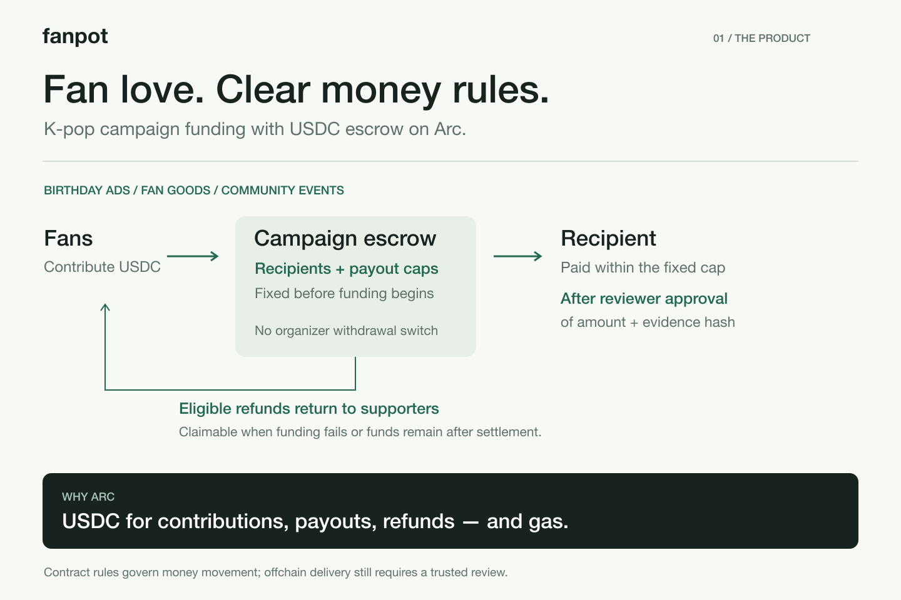
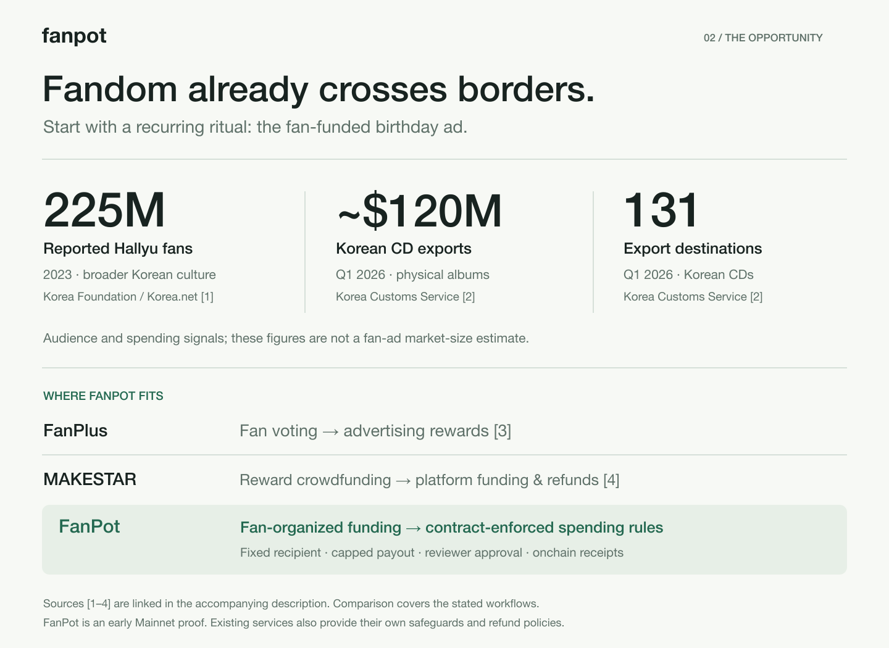

# FanPot application copy

**Title:** FanPot — K-pop Funding You Can Verify

**Vision (236 characters):** Fans pool money for birthday ads and goods. FanPot makes the spending rules visible and enforceable: USDC escrow on Arc, fixed recipients and payout caps, reviewer approval, and claimable refunds. One currency for contributions and gas.

The formatted application body is [application.html](application.html). It is an application draft, not a submitted entry. Keep market context separate from product traction. Preserve sources and the current-scope paragraph when copying.

## Summary images





## Source and claim boundaries

- [Korea.net / Korea Foundation](https://www.korea.net/NewsFocus/Society/view?articleId=248349): 225 million reported Hallyu fans at the end of 2023. This is broader Korean culture. It is not a deduplicated count of K-pop buyers or FanPot customers.
- [Korea Customs Service](https://www.customs.go.kr/kcs/na/ntt/selectNttInfo.do?bbsId=1362&mi=2891&nttSn=10162525&nttSnUrl=179890e073bed46afdac69472414d73f): Q1 2026 Korean CD exports approximately USD 120 million, 131 export destinations. Trade value is not retail revenue or fan-ad spend. Do not add these figures together or use them as a serviceable market estimate.
- [FanPlus FAQ](https://fanplus.co.kr/en-US/faq): monthly birthday/debut-anniversary voting and advertising rewards. No assertion is made about absence of safeguards.
- [MAKESTAR official terms](https://policies.makestar.com/makestar-terms/en/20260806/): reward crowdfunding, platform funding conditions and refund policies. No assertion is made that it lacks refunds or transparency.
- [Arc network](https://www.arc.io/network): USDC gas and EVM support. FanPot has not integrated CCTP, Gateway, a fiat onramp or gas sponsorship. The architecture is not claimed to be impossible on other chains.
- Implementation claims: `packages/contracts/src/FanPotCampaign.sol`, `apps/web/data/arc-mainnet-deployment.json`, and `pnpm verify:proof`. Mainnet proof concerns deployment, creation, activation and the builder contribution; payout/refund demonstrations remain Testnet.

Research checked September 28, 2026. The chosen 2023 fandom figure has an explicit observation year; it is not presented as a current 2026 count.

## Rebuild graphics

From the repository root, after installing project dependencies:

```sh
node docs/submission/build-graphics.mjs
```

SVG sources and PNG exports contain identical copy. Diagrams were authored in code to keep factual labels exact and legible.
